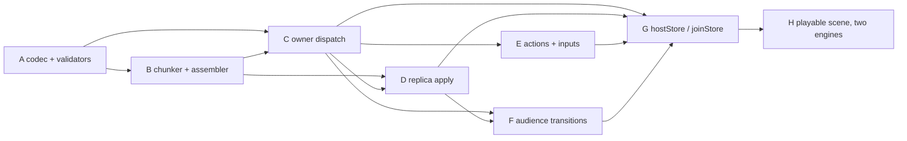

# Stage 7 — the browser game store: replacement brief (PROPOSAL, not authority)

**Status: proposal for Kyra's review. This document authorizes no
production implementation.** It replaces the superseded
`spikes/S7_BRIEF.md` (packaged anchor, binding parity, shared TS types),
which must not be dispatched.

**Source baseline: `b235f72570c02eac8031b33e463f77a91b7595c0`.** Kyra
verified that HEAD and a clean working tree. That is a pin for reading
and diffing only — **it is not an independently accepted implementation
base**, and nothing below should be read as claiming it is.

Scope is unchanged from the plan's Stage 7
(`docs/internal/plans/BROWSER_NATIVE_WEBRTC_TRANSPORT_PLAN.md:2825`) and
the API design
(`docs/internal/plans/BROWSER_GAME_STORE_API_DESIGN.md`): the browser
package and the networked store. Every packaging and parity deferral in
the plan's §Deferred stands — dedicated anchor crate, binary release
matrix, Docker/compose/GHCR, Node/Python/Go/C anchor-role parity and its
FFI surfaces, shared generated types across `sdk-ts`, general
statistics/Deck expansion, serverless, CRDTs, asset economies,
browser-side RedEX, ICE-TCP, DTLS-exporter.

---

## 1. The store protocol

UTF-8 JSON. One versioned envelope, named kinds, no free-form body.

### 1.1 Identifier representations

The rule is the one the package already enforces at its boundary, and it
exists because two spellings of one id is a defect class this repository
has already paid for (`node.ts`: a decimal node id passed to a hex-only
method addresses a *different* node rather than failing).

| Value | Representation | Why |
|---|---|---|
| node id (`authority`) | 16 lowercase hex | The spelling `nodeIdHex()` hands out and `connectPeer` takes. A decimal id is **refused**, never coerced. |
| store definition id | string, ≤ 128 bytes | From `defineStore`. |
| store definition version | JSON integer, `1 ..= 2^31-1` | Small by construction; a non-integer is malformed. |
| application key | string, ≤ 128 bytes | Names the ship/room/region. |
| incarnation | 16 lowercase hex | One per hosted-store instance, CSPRNG at `hostStore`. |
| handle id | 32 lowercase hex (16 bytes) | Owner-issued, CSPRNG, never caller-chosen. |
| generation, revision, sequence | **exact decimal strings** | `u64`. A JS number rounds above 2^53, and a rounded fence has stopped fencing. |
| chunk index / count | JSON integer, `0 ..= 255` | Bounded below the JS-number hazard. |
| chunk payload | base64 of UTF-8 bytes | See §1.7. |

### 1.2 Envelope

Every message carries exactly these common fields, and no others:

```json
{ "v": 1, "k": "<kind>", "h": "<handle>" }
```

- `v` — **protocol** version. Not the store's. An unknown `v` is refused
  whole (`code: "version-mismatch"`); no field of an unknown version is
  read, because reading one is how a forward-compatible parser becomes
  an attack surface.
- `k` — kind, from the closed set in §1.4.
- `h` — handle id. Absent **only** on `join` and on a `no` that refuses a
  `join`, because there is no handle yet.

**There is no originator field, and that is deliberate.** See §1.3.

### 1.3 Authenticated session binding

- A store message is accepted **only** on a peer-addressed stream over an
  established end-to-end session (direct or routed). The caller's
  identity is **the session's authenticated peer** and is never read from
  the message.
- The envelope therefore carries no `peer`/`from`. A field that can be
  written cannot be an identity, and having one invites the mistake.
- An **anchor-addressed** stream and a generic channel event are **not**
  admissible transports for store messages: the former's session peer is
  the anchor, the latter carries an origin *hash*. An origin-hash →
  node-id lookup identifies a candidate; a verified announcement binds
  that candidate to identity material; neither proves this message came
  from it (design doc, "Identity: an announcement lookup is not
  authentication"; `leaf/src/node.rs` §9 step-2 witnesses around `:3483`
  for what does).
- The owner binds each handle to the authenticated peer at admission and
  re-checks on every subsequent message: a session replacement does not
  re-authorize a handle (§1.5).

### 1.4 Kinds

Caller → owner: `join`, `act`, `in`, `aud`, `leave`.
Owner → caller: `joined`, `snap`, `delta`, `res`, `no`.

```json
{"v":1,"k":"join","def":"pirate.ship","ver":1,"key":"black-petrel",
 "aud":["crew"]}

{"v":1,"k":"joined","h":"<32hex>","inc":"<16hex>","g":"1","r":"418",
 "n":3,"bytes":"14208"}

{"v":1,"k":"snap","h":"<32hex>","g":"1","r":"418","i":0,"n":3,
 "d":"<base64>"}

{"v":1,"k":"delta","h":"<32hex>","g":"1","base":"418","r":"419",
 "ops":[{"o":"r","p":["ship","heading"],"val":90},
        {"o":"x","p":["crew","bosun"]}]}

{"v":1,"k":"act","h":"<32hex>","s":"7","name":"fire",
 "in":{"cannon":"port"}}
{"v":1,"k":"res","h":"<32hex>","s":"7","out":{"shot":12}}

{"v":1,"k":"in","h":"<32hex>","name":"helm","s":"1904",
 "in":{"heading":31.5}}

{"v":1,"k":"aud","h":"<32hex>","g":"2","aud":["sea.havana","ship.crew"]}
{"v":1,"k":"leave","h":"<32hex>"}

{"v":1,"k":"no","h":"<32hex>","code":"forbidden","detail":"…","s":"7"}
```

`no.code` is exactly `StoreErrorCode`
(`browser-ts/src/store/errors.ts`), including `result-expired`. `s` is
present only when the refusal answers a specific `act`.

### 1.5 Handle admission

- `join` is the only message that may create a handle. The owner
  authenticates the caller (§1.3), validates `def`/`ver`/`key`, calls
  `authorize({type:'read'})`, and **mints** a fresh CSPRNG handle bound
  to `(authenticated peer, incarnation)`.
- `act`/`in`/`aud`/`leave` address an **already active** handle. They
  never create or reactivate one. An unknown or expired handle is
  refused `closed` before any dispatch, with no permanent tombstone.
- Rejoining mints a new handle. A caller may not select or reuse one.
- A transport reconnect is not a new identity: a still-live handle may
  resume after re-authentication; an expired one requires a fresh join,
  and prior action outcomes are then **unknown** (§1.9).

### 1.6 Subscription generations

- `g` is monotone per handle, incremented at join and at every accepted
  `aud`.
- The owner emits `snap`/`delta` stamped with the generation they belong
  to. A replica **drops** any `snap`/`delta` whose `g` is not its current
  one, and counts it. It does not apply it and does not resync on it: a
  late emission from a retired subscription must not repopulate a view
  the caller has moved off.
- An `aud` immediately fences the old generation, marks the view
  `syncing`/`stale`, and clears the former projection to the
  definition's validated `empty()` (absence, not fabricated values)
  before the new view is exposed.

### 1.7 Snapshot chunks

- The owner serializes the **projected** state to UTF-8 JSON, splits the
  **bytes** into `n` pieces, and sends `i = 0..n-1`.
- Each piece is base64 in `d`. Base64 because splitting UTF-8 on byte
  boundaries can split a code point: carrying raw text would make an
  interior chunk invalid JSON string content. Cost is +33 %, and it is
  accounted for in the budget rather than discovered.
- **Budget, derived at runtime, never hardcoded:**

  ```ts
  const ENVELOPE_RESERVE = 192;                 // measured worst case: 134 B
  const chunkBytes = Math.floor((maxEventBytes() - ENVELOPE_RESERVE) / 4) * 3;
  ```

  At today's wire that is `floor((8104 − 192)/4) * 3 = 5934` raw bytes
  per chunk: 7 912 base64 characters plus a 134-byte envelope is 8 046,
  which is 58 bytes inside the limit. Every field is at its maximum
  spelling in that measurement — `u64` generation and revision as
  20-digit decimals, a 32-hex handle, `i`/`n` at 255 — so the reserve is
  a bound and not a sample.
- `maxEventBytes()` is the wire's `MAX_EVENT_SIZE` (`accb8f2f9`) — the
  packet cap **minus** header, tag and the event frame's 4-byte length
  prefix. `MAX_PAYLOAD_SIZE` (8108) is not available data bytes;
  treating it as such overruns by exactly the prefix.
- The complete encoded transport payload therefore fits the unfragmented
  limit, so the snapshot's necessary path does not invoke transport
  fragmentation. **This does not waive fragmentation regressions
  elsewhere and does not prove independence from the shared
  reliability/reassembly code the chunks still ride** — §4 says where
  that has to be established rather than assumed.
- `n ≤ 180` and `bytes ≤ 1 MiB`; a snapshot that would exceed either is
  the owner's refusal (`capacity`) at projection time, not a truncation.

### 1.8 Atomic patches and revisions

- `r` is monotone per `(handle, generation)` over the **projected view**,
  not over the owner's whole state. Changes the viewer cannot see must
  never surface as unexplained revision gaps.
- `delta.base` must equal the replica's current `r`. If it does not, the
  replica requests resynchronization; it never applies a patch whose
  base it has not got, and never applies a dependent successor over a
  gap.
- Patch operations are `{"o":"r","p":[…],"val":…}` (replace) and
  `{"o":"x","p":[…]}` (remove). `p` is an array of **property-name
  segments**, ≤ 8 deep, each ≤ 64 bytes. No JSON Pointer escaping, no
  arbitrary or executable operations. Arrays are replaced whole in v1.
- A patch is validated **complete**, then applied, then committed as one
  revision, preserving unchanged subtree references
  (`store/state.ts::reconcile`, `dcc13ca7c`). A half-applied patch is
  never published; a failed patch leaves the previous revision intact
  and triggers resynchronization.

### 1.9 Actions and results

- `s` is monotone per handle. Request identity is
  `(authenticated caller, handle, s)` within one incarnation.
- The owner keeps a bounded in-memory result ledger (§2) and a
  non-reexecution floor:
  - `s` above the floor and unseen → validate, `authorize`, execute once,
    reply `res`.
  - `s` retained in the ledger → reply the **retained result**. This is
    evidence of the original commit, so replaying it is honest.
  - `s` at or below the floor but no longer retained → `no` with
    `result-expired`, which asserts only *cannot execute again, original
    result unavailable*. It is **not** a success receipt: a retired
    sequence may have been rejected, aborted before commit, or fenced
    without executing. Reporting a commit here is prohibited.
- No automatic resend after connection or leader change. An action
  aborted or refused before submission is known not to have executed;
  once submitted, timeout/abort/session loss is `indeterminate` unless a
  `res` or `no` establishes the outcome.

### 1.10 Latest inputs

- `s` is monotone per `(handle, input name)`. The owner applies a strictly
  increasing `s` and **drops** any `s ≤ last seen`, counting it.
- Fire-and-forget: loss is not an error and there is no retention, no
  replay and no gap recovery. A dropped input is superseded intent.
- One pending slot per `(handle, name)` on the caller; at most one
  in-flight send plus one replacement.

### 1.11 Malformed messages

Ordered, because the cheap checks must come first and none of them may
run after a mutation:

1. **Byte length** > the transport's admissible size → refuse, count, no
   parse.
2. **JSON parse** with bounded depth (≤ 16) and no duplicate keys → on
   failure refuse `invalid-data`, count.
3. **Envelope**: `v`, `k` in the closed set, `h` present iff required →
   refuse whole; never partially read an unknown version or kind.
4. **Binding**: handle active, bound to this authenticated peer, this
   incarnation, current generation where applicable.
5. **Payload**: the definition's validators.

Every refusal is typed, counted, and leaves no partial state. A
malformed message never advances a sequence, a revision or a generation.

---

## 2. Resource ownership

No unbounded state, no silent retry of an ambiguous action.

| Bound | Value | Reclaimed by |
|---|---|---|
| snapshot bytes | 1 MiB | refusal at projection (`capacity`) |
| store message bytes | derived (§1.7) | refusal before parse |
| chunk assembly | **one** in-flight per `(handle, generation)`, ≤ 1 MiB, ≤ 180 chunks | completion; generation change; 10 s assembly deadline; handle expiry |
| patch depth / segment | ≤ 8 / ≤ 64 B | refusal |
| pending actions per handle | 32 | refusal (`capacity`) |
| result ledger per handle | last 32 results **or** 60 s, whichever is smaller | floor advance → `result-expired` |
| audience labels per handle | 32, each ≤ 128 B | refusal |
| handles per owner | 256 | refusal (`capacity`) |
| buffered owner egress | 1 MiB across all handles | refusal (`capacity`) |
| handle lease | 60 s without an authenticated message | handle + ledger removed, no tombstone |
| join / action / audience deadline | 10 s | typed `timeout`; action becomes `indeterminate` |

Fencing:

- **Chunk assembly** is discarded on generation change, handle expiry and
  deadline. A partial snapshot is never published and never merged into a
  later one.
- **Cancellation is per waiter.** Equal pending audience requests share
  the transition but not its cancellation: each waiter has its own
  deadline/signal; cancelling one removes only that waiter, and if none
  remain the transition is fenced and the handle stays non-ready. A
  different newer request supersedes and rejects the older's waiters. No
  aborted promise may later resolve from a snapshot callback.
- **Stale continuations** cannot write: a transaction context is valid
  only during its synchronous transaction (`store/core.ts`, `dcc13ca7c`).
- **Expired handles** are refused before dispatch, and their ledger goes
  with them — which is exactly why replay after eviction is
  `result-expired` and not a re-execution.

---

## 3. Settled design this brief preserves

1. **One shared TypeScript peer driver** (`peer-driver.ts`, `eae11eca9`)
   used by `BrowserNode` and `MeshSession`. No second implementation in
   TS or Rust.
2. **Chunks fit the effective unfragmented payload limit, overhead
   included**, derived from `maxEventBytes()` (§1.7).
3. **Explicit absence in projections**: collections omit invisible
   entities, hidden fields are explicit `null` or a tagged value,
   `empty()` is absence. Zero never means "you cannot see this".
4. **Structural sharing**: unchanged subtrees retain identity; an
   equivalent resynchronization snapshot is a no-op.
5. **Peer-addressed authenticated sessions** for delivery, direct or
   routed. Never anchor-addressed streams or generic channel events for
   store traffic (§1.3).

---

## 4. Implementation prerequisites vs acceptance gates

**Prerequisite** = the slice cannot be written without it.
**Acceptance gate** = the slice can be written and adversarially tested,
but may not be *accepted* without current-head evidence.

| # | Slice | Prerequisites | Acceptance gates |
|---|---|---|---|
| A | Protocol codec + validators (§1), local only | none beyond the baseline | none — local, deterministic |
| B | Chunker + assembler, reclamation (§1.7, §2) | A; `maxEventBytes()` (landed) | **Reliable transfer** at the current head: that chunks ride the shared reliability/reassembly path intact under loss, duplication and reorder. The chunking decision removes *large-frame fragmentation* from this path; it does not establish the rest. |
| C | Owner dispatch: join/admission/authorize/projection | A, B | **Authenticated origin.** `authorize` must receive the authenticated originating caller. Not acceptable on any substitute. |
| D | Replica: snapshot install, delta apply, resync, generations | A, B, C | Reliable transfer (as B) |
| E | Actions, results, ledger, latest inputs | C | Authenticated origin (C), and the ledger's semantics from §1.9 |
| F | Audience transitions | C, D | Authenticated origin |
| G | `hostStore` / `joinStore` exports over `MeshSession` | C–F | **Leader-proxy lifecycle**: follower tabs, last-consumer cleanup, and the peer/stream lifecycle. Membership lifecycle and peer-addressed proxied streams are landed (§6); the *store's* use of them on a follower is not yet established. |
| H | Playable Three.js scene, two engines, direct + forced fallback | G | All three gates, plus the netns/browser split in §5.4 |

**On the historical HOLDs.** This brief does not mark S6-01 or Stage 5
R4-1..R4-10 repaired, and does not assert they still reproduce. Either
claim needs current-head evidence, and neither is in hand. What the
brief does is name the three properties (authenticated origin, reliable
transfer, leader-proxy lifecycle) and the slices whose *acceptance*
requires each, so closure can be established against the head that is
actually delivered.

---

## 5. Acceptance cases

Derived from the contract. Encoder/decoder round trips are table stakes
and are **not** listed as acceptance.

### 5.1 Adversarial — required

| Case | Observable |
|---|---|
| **Forged origin** — a peer sends `act` naming another caller's handle on its own authenticated session | refused `closed`, handler ran 0 times, no revision, counter moved. The handle's binding, not a field, is what refuses it. |
| **Wrong owner** — a third peer advertises the same `def`/`key` and emits `snap`/`delta` to a joined replica | dropped, view unchanged at its current revision, counter moved. Definition/key coincidence is not authority. |
| **Wrong session** — a valid handle's messages arrive on a different session (post-replacement) | re-authentication required; a handle is not resumed onto an unauthenticated session |
| **Stale handle** — `act` after handle expiry | `closed` before dispatch, handler 0 times, no tombstone retained |
| **Stale generation** — `delta` for a retired `g` after an `aud` | dropped, not applied, not treated as a resync trigger; the new view's revision unchanged |
| **Revision gap** — `delta.base` ≠ current | resynchronization requested; the patch is **not** applied; no dependent successor applied over the gap |
| **Conflicting duplicate chunks** — two `snap` with the same `(g, r, i)` and different `d` | assembly refused and restarted; **no** publication of either; counter names the conflict |
| **Partial snapshot** — `n-1` of `n` chunks, then the deadline | nothing published; the assembly reclaimed; status stays `syncing`/`stale`, never `ready` |
| **Replay after result eviction** — `act` with an `s` below the floor and evicted | `result-expired`; handler ran 0 times; **no success receipt**, and the reply does not claim a commit |
| **Replay within retention** | the retained result, byte-identical; handler ran 0 times |
| **Audience removal during synchronization** — `aud` while a snapshot is in flight | the in-flight assembly is fenced and discarded; the projection is cleared to `empty()`; the older transition's waiters are rejected and cannot later resolve from a snapshot callback |
| **Oversized message** | refused before parse, on byte length |
| **Depth bomb / duplicate keys** | refused at parse, bounded, counted |
| **Unknown `v` / `k`** | refused whole; no field read |

### 5.2 Contract behaviour — required

Unchanged-update silence; selector equality; subtree identity across an
equivalent resync; `empty()` distinguishable from a zeroed record;
absence of replica `setState` at the type level; atomic patch commit;
one revision per accepted transaction.

### 5.3 Witness discipline

Every case above states its **observable on the refusing side** — a
counter, a handler invocation count, a revision, a published/not-published
view. A test that asserts only the error text is not accepted: a refusal
that arrives *after* the mutation satisfies it and misses the defect
(this has already happened twice in this stage — the entity-identity
oracle and the release-frame oracle, both fixed only because the inverse
was run). Each witness carries an applied-red-reverted inverse.

### 5.4 Execution environment

- Browser execution is **not** Linux-only. Chromium and Firefox runs need
  no netns and are expected to run wherever the harness runs.
- **Linux netns evidence is CI-only on this host.** Not a licence to mock
  it.
- **Firefox is absent from the demo harness today** (`browser-demo` is
  Chromium-only, floor 5). Adding and executing that leg is work, not
  inherited coverage.
- wasm witnesses (`wasm_witnesses.rs`) need a chromedriver, which this
  host lacks; they run in the leaf-wasm job. Any claim from them must say
  so.

---

## 6. Inventory reconciliation at the baseline

### 6.1 Landed, with receipts

| Commit | What | Receipts |
|---|---|---|
| `dcc13ca7c` | Local store: `defineStore`, contract types, `StoreCore` (state, subscriptions, status, synchronous transaction), structural sharing | 31 witnesses; 5 inverses red/reverted; +4 635 B bundled, tree-shakeable |
| `557fb84d4` | `LeafNode::unsubscribe` through the production `0x0A00` encoder; claim deregistered; `FollowerRegistry::release` | 3 witnesses, 3 inverses; core honours it (`mesh.rs:33720`) |
| `42d32640a` | Last-consumer decision at the layer that sees both `declared` and `restoration()`; `MeshSession.unsubscribe` | native arithmetic witness + inverse reproducing the unsound gate |
| `688e4f08a` | `LeaderRequest::StreamOpen` carries `peer`; `require_anchor_addressed` deleted | codec round-trip + inverse |
| `c1876d62e` | `attempt_for` dialog fence; `peer_candidate_in` / `peer_handshake_in`; fixed a wasm test target broken by `688e4f08a` | wasm witness (CI-executed); `--all-targets` on both targets adopted |
| `00509bd28` | Four dialog-named peer requests, codec, leader arms, `MeshSession` methods | round-trip witnesses |
| `eae11eca9` | One shared TS peer driver; both surfaces on it; supersession classified from both sources | 8 witnesses, 2 inverses; 223 pre-existing tests unchanged |
| `accb8f2f9` | `LeafNode.maxEventBytes()` publishes the unfragmented limit | real-package probe pins the arithmetic; inverse against a rebuilt wasm |
| `b235f7257` | Proxy traffic measured as a shape, not quoted | 3 poll counts; inverse |

Also landed, docs: `7533eb9dc` (four dispositions), `fa0cf4c77` (approach
dispositions + the identity correction).

### 6.2 Remaining, with dependencies



Not started: A–H. Open from the landed work: effective subscription
acknowledgement as the store's readiness witness (a resolved enqueue is
not one); `authorize`'s authenticated input (blocked, §4 C).

### 6.3 Deferrals preserved

Everything in the plan's Stage 7 §Deferred, verbatim in effect. Nothing
in this brief reopens packaging, binding parity or shared generated
types, and no slice above depends on them.

---

## 7. Surfaced for review

Genuine authority or behavioural decisions. Ordinary implementation
choices — field spellings, the 192-byte envelope reserve, base64 over a
code-point-safe split — are made above and are not blockers.

1. **Replaying a retained result is a success receipt, and I claim that
   is correct.** §1.9 replies the retained result to a duplicate within
   retention. That *does* assert the original committed — which is sound
   only because the ledger stores the result of a commit that happened.
   The prohibition is on inferring a commit from the *floor*
   (`result-expired`). If you want replay to also refuse, say so: it is
   safer and materially worse for a game client.
2. **Handle lease of 60 s evicts a backgrounded tab.** A phone that
   backgrounds for a minute loses its handle and rejoins with unknown
   prior action outcomes (§1.5). The alternative is a longer lease and
   more owner state per absent caller. This is a product trade, not an
   implementation detail.
3. **A denied read closes that subscription** (design §5) rather than
   degrading it to an empty projection. Confirming, because it makes a
   transient authorization failure indistinguishable from a permanent one
   to the caller, who must rejoin.
4. **Latest inputs have no gap signal.** §1.10 drops superseded inputs
   silently by design. A game that needs to know it is being rate-limited
   gets nothing. I propose a per-handle dropped-input counter on the
   owner, readable by the owner's own code only — not a protocol message.
   Flagging in case you want it surfaced to the caller instead.
