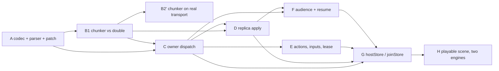

# Stage 7 — the browser game store: replacement brief (PROPOSAL, not authority)

**Status: proposal for Kyra's review, repair round 1. This document
authorizes no production implementation.** It replaces the superseded
`spikes/S7_BRIEF.md` (packaged anchor, binding parity, shared TS types),
which must not be dispatched.

**Source baseline: `b235f72570c02eac8031b33e463f77a91b7595c0`.** Kyra
verified that head and a clean working tree, and independently
reproduced the chunk arithmetic (134-byte envelope, 5 934 raw, 8 046
encoded, 58 bytes headroom). That is a pin for reading and diffing only —
**it is not an independently accepted implementation base**, and Kyra's
review of this brief is not acceptance of the production transport
repairs or of the implementation receipts reported in §6.

**B2 remains independently open.**

### Repair round 1 — what changed and why

Held at `1cfaf2193be6bc711b5437250918b63706277bb2`: direction sound, wire
contract left necessary operations undefined. This round is a bounded
documentation repair, not a redesign. The accepted transport, chunking
and replay decisions are preserved verbatim.

| # | Repair | Where |
|---|---|---|
| 1 | The control exchange and its correlation: resume, resynchronize, concurrent joins, audience acknowledgement — plus who allocates `g` | §1.2, §1.4, §1.5–1.8 |
| 2 | The lease no longer expires a healthy idle spectator | §1.6, §2 |
| 3 | Action retirement, rejection, replay binding, floor advance, exhaustion — and the `closed` / `result-expired` contradiction resolved | §1.10, §2 |
| 4 | Message budgets beyond snapshots: actions, results **before commit**, deltas, refusal details, startup fail-fast, byte budgets | §1.9, §1.11, §2 |
| 5 | Parser and patch semantics frozen, not exemplified | §1.12, §1.13 |
| 6 | The gate statement reconciled: local chunker acceptance separated from transport-composition acceptance | §4 |

One correction accepted into the text: my "a field that can be written
cannot be an identity" was inaccurate as stated — a *signed* field can
carry authenticated identity. The store's boundary is right for a
different reason, now given properly in §1.3.

Scope is unchanged from the plan's Stage 7
(`docs/internal/plans/BROWSER_NATIVE_WEBRTC_TRANSPORT_PLAN.md:2825`) and
the API design
(`docs/internal/plans/BROWSER_GAME_STORE_API_DESIGN.md`). Every
packaging and parity deferral in the plan's §Deferred stands — dedicated
anchor crate, binary release matrix, Docker/compose/GHCR,
Node/Python/Go/C anchor-role parity and its FFI surfaces, shared
generated types across `sdk-ts`, general statistics/Deck expansion,
serverless, CRDTs, asset economies, browser-side RedEX, ICE-TCP,
DTLS-exporter.

---

## 1. The store protocol

UTF-8 JSON. One versioned envelope, a closed kind set, no free-form body.

### 1.1 Identifier representations

The rule is the one the package already enforces, and it exists because
two spellings of one id is a defect class this repository has paid for
(`node.ts`: a decimal node id passed to a hex-only method addresses a
*different* node rather than failing).

| Value | Representation | Why |
|---|---|---|
| node id (`authority`) | 16 lowercase hex | The spelling `nodeIdHex()` hands out and `connectPeer` takes. A decimal id is **refused**, never coerced. |
| store definition id | string, 1..=128 bytes | From `defineStore`. |
| store definition version | JSON integer, `1 ..= 2^31-1` | Small by construction. |
| application key | string, 1..=128 bytes | Names the ship/room/region. |
| incarnation `inc` | 16 lowercase hex | One per hosted-store instance, CSPRNG at `hostStore`. |
| handle id `h` | 32 lowercase hex (16 bytes) | Owner-issued, CSPRNG, never caller-chosen. |
| request id `q` | 16 lowercase hex (8 bytes) | Caller-issued per request, CSPRNG. §1.2. |
| generation `g`, revision `r`, sequence `s` | **canonical decimal strings** | `u64`. A JS number rounds above 2^53, and a rounded fence has stopped fencing. Canonical form: §1.12. |
| chunk index `i` / count `n` | JSON integer, `i` `0..=254`, `n` `1..=255` | Bounded below the JS-number hazard; `n ≥ 1` always. |
| chunk payload `d` | canonical base64 of UTF-8 bytes | §1.9, §1.12. |

### 1.2 Envelope and correlation

Every message carries exactly these common fields:

```json
{ "v": 1, "k": "<kind>", "h": "<handle>", "q": "<request>" }
```

- `v` — **protocol** version, not the store's. An unknown `v` is refused
  whole (`version-mismatch`); no field of an unknown version is read,
  because reading one is how a forward-compatible parser becomes an
  attack surface.
- `k` — kind, from the closed set in §1.4.
- `h` — handle id. Absent **only** on `join` and on the reply to a
  `join`, because there is no handle yet.
- `q` — **request id, and this is the repair.** Every caller→owner
  request carries one; every owner→caller reply *to* a request echoes it
  verbatim. Unsolicited owner→caller emissions (`delta`, and the `snap`
  stream of an owner-initiated resync) carry no `q`.

**Why a request id rather than a stream per join.** A dedicated stream
would also work, but it makes the correlation implicit in transport
allocation and adds ownership and replacement rules for the stream
itself. `q` correlates:

- **two concurrent joins from one caller**, neither of which has a
  handle yet — the thing the previous draft could not express;
- **an audience transition's acknowledgement or refusal**, so a delayed
  `no` cannot be mistaken for the current transition. This is the
  correlation the previous draft lacked: `no` had `s` for actions and
  nothing for audiences;
- **a resume and a resynchronization**, which are otherwise
  indistinguishable from the emissions they trigger.

A reply whose `q` the caller does not have outstanding is **dropped and
counted**, never applied. A duplicate `q` from the same caller within its
retention window (§2) is refused `invalid-data`; `q` is not a
deduplication key for actions — `s` is (§1.10).

### 1.3 Authenticated session binding

- A store message is accepted **only** on a peer-addressed stream over an
  established end-to-end session (direct or routed). The caller's
  identity is **the session's authenticated peer**.
- The envelope carries no originator field. The reason is not that
  written fields cannot be authenticated — a *signed* field can be — but
  that this protocol has no signing layer of its own and must not grow
  one: its authority is the session the mesh already authenticated, so a
  second identity claim inside the payload could only ever be a weaker,
  unverified duplicate of it.
- An **anchor-addressed** stream and a generic channel event are
  **inadmissible** transports for store messages: the former's session
  peer is the anchor, the latter carries an origin *hash*. An
  origin-hash → node-id lookup identifies a candidate; a verified
  announcement binds that candidate to identity material; neither proves
  this message came from it. What does: the accepted end-to-end
  establishment and its authenticated receive path
  (`leaf/src/node.rs` §9 step-2 witnesses around `:3483` — the responder
  stays provisional until the initiator's establishment proof over the
  handshake transcript promotes it).
- The owner binds each handle to the authenticated peer at admission and
  re-checks on every subsequent message. A session replacement does not
  re-authorize a handle; it requires `resume` (§1.6).

### 1.4 The kind set

Caller → owner, each carrying `q`:
`join`, `resume`, `resync`, `act`, `in`, `aud`, `alive`, `leave`.

Owner → caller:
`man` (manifest, echoes `q` when solicited), `snap`, `delta`, `res`,
`ok`, `no`.

```json
{"v":1,"k":"join","q":"<16hex>","def":"pirate.ship","ver":1,
 "key":"black-petrel","aud":["crew"]}

{"v":1,"k":"man","q":"<16hex>","h":"<32hex>","inc":"<16hex>",
 "g":"1","r":"418","n":3,"bytes":"14208"}

{"v":1,"k":"snap","h":"<32hex>","g":"1","r":"418","i":0,"n":3,
 "d":"<base64>"}

{"v":1,"k":"delta","h":"<32hex>","g":"1","base":"418","r":"419",
 "ops":[{"o":"r","p":["ship","heading"],"val":90},
        {"o":"x","p":["crew","bosun"]}]}

{"v":1,"k":"resume","q":"<16hex>","h":"<32hex>"}
{"v":1,"k":"resync","q":"<16hex>","h":"<32hex>","g":"1","have":"418"}
{"v":1,"k":"aud","q":"<16hex>","h":"<32hex>","aud":["sea.havana"]}
{"v":1,"k":"alive","q":"<16hex>","h":"<32hex>"}
{"v":1,"k":"leave","q":"<16hex>","h":"<32hex>"}

{"v":1,"k":"act","q":"<16hex>","h":"<32hex>","s":"7","name":"fire",
 "in":{"cannon":"port"}}
{"v":1,"k":"res","q":"<16hex>","h":"<32hex>","s":"7","out":{"shot":12}}

{"v":1,"k":"in","h":"<32hex>","name":"helm","s":"1904",
 "in":{"heading":31.5}}

{"v":1,"k":"ok","q":"<16hex>","h":"<32hex>"}
{"v":1,"k":"no","q":"<16hex>","h":"<32hex>","code":"forbidden",
 "detail":"…","s":"7"}
```

`no.code` is exactly `StoreErrorCode` (`browser-ts/src/store/errors.ts`),
including `result-expired`. `s` appears only when the refusal answers a
specific `act`. `in` carries **no** `q`: it is fire-and-forget and has no
reply, so there is nothing to correlate (§1.11).

**`man` is the one manifest shape**, for all three cases that install a
view: a `join`, an accepted `aud`, and a `resync`. It states the
generation, the revision the snapshot is taken at, the chunk count and
the exact decoded byte total. The chunks that follow carry the same
`(g, r)`. The previous draft specified this only for the initial join.

### 1.5 Handle admission

- `join` is the only message that may **create** a handle. The owner
  authenticates the caller (§1.3), validates `def`/`ver`/`key`, calls
  `authorize({type:'read'})`, and mints a fresh CSPRNG handle bound to
  `(authenticated peer, incarnation)`.
- `act`/`in`/`aud`/`alive`/`leave`/`resync` address an **already active**
  handle. They never create or reactivate one. An unknown or expired
  handle is refused `closed` before any dispatch, with no permanent
  tombstone.
- Rejoining mints a new handle; a caller may not select or reuse one.
- Two concurrent `join`s from one caller are two independent handles,
  correlated by their own `q`. Nothing is shared between them.

### 1.6 Resume, and the liveness the lease needs

**The repair.** The previous draft's lease expired after no authenticated
*incoming* message, which expires a connected spectator that receives
updates and sends nothing. That is a healthy client, and expiring it is a
defect.

- The replica's store implementation sends `alive` on an interval of
  **20 s** while the handle is live. This is store machinery, never game
  code: a page that renders a spectator view does nothing to stay
  subscribed.
- The lease is **60 s** — three intervals, so two lost `alive` messages
  do not evict a live client.
- **Renewal is by an accepted authenticated message only.** `act`, `in`,
  `aud`, `alive`, `resync` and `leave` renew when they pass §1.12's
  ladder through step 4 (binding). A malformed message, a message for an
  unknown or expired handle, and a message refused at binding renew
  **nothing** — otherwise a peer that cannot form a valid request could
  hold a handle open indefinitely.
- **Renewal stops** at `leave`, at handle expiry, at incarnation end, and
  when the owner refuses the handle for policy (`forbidden`). The replica
  stops sending `alive` on any of these and on `close()`.
- **Expiry notification.** On expiry the owner emits an unsolicited
  `no {code:"closed"}` for that handle if a session to the caller is
  still up, so a client that was merely slow learns why rather than
  inferring it from silence. If no session is up, nothing is sent and the
  handle is simply gone — the owner does not retain a tombstone to
  announce later.
- **Foreground recovery.** A returning caller sends `resume {h}`. The
  owner re-authenticates the session peer, re-checks the handle binding
  and read authorization, and answers either:
  - `man` + `snap` chunks for the caller's current generation when the
    handle is live but the caller's revision is unknown or stale; or
  - `ok` when the handle is live and the caller's view is current
    (`resume` may carry no revision claim, so `ok` means "still yours,
    nothing installed"); or
  - `no {code:"closed"}` when the handle is gone — and **no original
    action outcome is inferred** from that (§1.10).
- A `resume` for a handle bound to a different peer is `closed`, not
  `forbidden`: the refusal must not disclose that the handle exists.

### 1.7 Subscription generations, and who allocates them

**The repair.** `g` is **owner-allocated**. A caller never proposes one.

- `g` is monotone per handle, allocated **only on acceptance**: at `join`
  and at each accepted `aud`. A refused, superseded or malformed `aud`
  consumes no generation, so **no generation is ever reused**, and a
  caller cannot cause a gap or a collision by retrying.
- `aud` therefore carries no `g` — it carries `q`, and the accepting
  `man` carries the generation the owner allocated. The previous draft
  had the caller sending `g`, which is where reuse could have crept in.
- The owner stamps `snap`/`delta` with the generation they belong to. A
  replica **drops and counts** any `snap`/`delta` whose `g` is not its
  current one: it neither applies it nor treats it as a resync trigger,
  because a late emission from a retired subscription must not repopulate
  a view the caller has moved off.
- An accepted `aud` fences the old generation immediately, marks the view
  `syncing`/`stale`, and clears the projection to the definition's
  validated `empty()` — absence, not fabricated values — before the new
  view is exposed.
- Two `aud` requests in flight: the newer accepted one supersedes the
  older, whose waiters are rejected `aborted` **correlated by their own
  `q`**. A late `no` for a superseded transition is therefore
  attributable and cannot be mistaken for a refusal of the current one.

### 1.8 Resynchronization

- A replica sends `resync {h, g, have}` when a `delta.base` does not
  equal its current revision, when a chunk assembly is abandoned (§2), or
  when a patch fails validation.
- The owner answers `man` + `snap` chunks at the current revision of that
  generation, or `no {code:"not-ready"}` if it cannot take a projection
  now (the replica retries under its own deadline), or
  `no {code:"closed"}` for a dead handle.
- `have` is advisory: the owner may always answer with a full snapshot.
  v1 defines no delta-from-`have` path, and a caller must not depend on
  one.
- The owner may also initiate a resynchronization by emitting an
  unsolicited `man` (no `q`) followed by chunks — used when a delta would
  exceed the message budget (§1.9).

### 1.9 Snapshot chunks, and the budget for every kind

- The owner serializes the **projected** state to UTF-8 JSON, splits the
  **bytes** into `n` pieces, and sends `i = 0..n-1`.
- Each piece is canonical base64 in `d`. Base64 because splitting UTF-8
  on byte boundaries can split a code point, and carrying raw text would
  make an interior chunk invalid JSON string content. The +33 % is
  accounted for below rather than discovered later.
- **Budget, derived at runtime, never hardcoded.** The reserve is the
  **`snap` envelope's**, not a global one — each kind's envelope is
  measured against its own frozen field list (§1.12):

  ```ts
  const SNAP_ENVELOPE_RESERVE = 192;   // measured worst case: 134 B
  const chunkBytes =
    Math.floor((maxEventBytes() - SNAP_ENVELOPE_RESERVE) / 4) * 3;
  ```

  At today's wire: `floor((8104 − 192)/4) * 3 = 5934` raw bytes per
  chunk — 7 912 base64 characters plus a 134-byte envelope is 8 046,
  which is 58 bytes inside the limit. Every field is at its maximum
  spelling in that measurement (20-digit `u64` decimals, 32-hex handle,
  `i`/`n` at 255), so the reserve is a bound and not a sample.
- `maxEventBytes()` is the wire's `MAX_EVENT_SIZE` (`accb8f2f9`) — the
  packet cap **minus** header, tag and the event frame's 4-byte length
  prefix. `MAX_PAYLOAD_SIZE` (8108) is not available data bytes;
  treating it as such overruns by exactly the prefix.
- **Measured envelopes for the other bounded kinds**, at maximum
  spelling, so each budget is derived and not assumed:

  | Kind | Envelope | Budget for its variable part |
  |---|---|---|
  | `snap` | 134 B | `chunkBytes` = 5 934 raw → 7 912 base64 |
  | `delta` | 151 B | `maxEventBytes() − 192` = 7 912 B for `ops` |
  | `man` | 197 B | none — fixed shape, no variable part |

  `man` exceeds the `snap` reserve and that is not a conflict: it
  carries no payload, and the reserve exists only to leave room for
  `d`. Stated because a single "envelope reserve" invites reading it as
  a global bound.
- **Startup fail-fast.** If `maxEventBytes()` is unavailable, or
  `chunkBytes < 1024`, or any frozen envelope exceeds
  `maxEventBytes()`, `hostStore` and `joinStore` **refuse to start**
  with a typed `capacity` error naming the numbers. A store that cannot
  fit its own envelope must not begin and then discover it.

**The repair: every kind has a size disposition, not only `snap`.**

| Kind | Disposition |
|---|---|
| `act` | The **caller** encodes and measures before submitting. Over budget → `StoreError('capacity')` thrown locally, **nothing sent, nothing executed**. |
| `res` | The owner validates the handler's output **and its encoded size before commit** (§1.10). Over budget → the transaction is discarded and the caller gets `no {capacity}`. An action must never commit and only then discover its result cannot be encoded. |
| `delta` | Encoded `ops` must fit the 7 912 B above. If a revision's ops do not, the owner emits **no delta for it**: it initiates a resynchronization (§1.8) for that handle instead. A bounded, defined path — not a silent drop and not an oversized frame. |
| `in` | Caller-side measured like `act`; over budget → `dropped/capacity` disposition, nothing sent. |
| `no.detail` | ≤ 256 B, truncated at the owner with a trailing `…`. A refusal that cannot be delivered is worse than a terse one. |
| `ok`, `resume`, `resync`, `alive`, `leave`, `man` | Fixed shape, bounded by construction and checked at startup. `aud` is bounded by 32 labels × 128 B, checked before send. |

### 1.10 Actions: retirement, rejection, replay

**The repair.** The ledger algorithm, complete.

- `s` is a canonical decimal `u64`, **strictly increasing per handle**,
  starting at `1`. Request identity is
  `(authenticated caller, handle, s)` within one incarnation.
- The owner keeps, per handle: a `floor` (the highest retired `s`), and a
  retained window of outcomes keyed by `s`, bounded by count, age and
  **bytes** (§2).
- Each retained entry records the outcome **and a digest of
  `(name, canonical(in))`** — the binding that makes replay safe.

Dispositions, exhaustively:

| Case | Disposition |
|---|---|
| `s` > every seen `s`, handle active | validate, `authorize`, execute once, retain and reply `res`. |
| `s` retained, same `(name, in)` digest | **re-`authorize` first**; if still permitted, replay the retained outcome byte-identically; if no longer permitted, `no {forbidden}`. A retained *refusal* replays as that refusal. |
| `s` retained, **different** `(name, in)` digest | `no {invalid-data}`. Not executed, and the retained entry is **not** overwritten: a sequence identifies one request, not a slot. |
| `s` ≤ `floor`, not retained, handle active | `no {result-expired}` — cannot execute again, original result unavailable, **no commit asserted**. |
| `s` ≤ some seen `s` but skipped (a gap) | Gaps are permitted and do not block. A `s` inside a gap that was never seen is treated as new **only if** `s` > `floor`; at or below the floor it is `result-expired`. |
| handle expired or unknown | `no {closed}`. **No original outcome is inferred** — this is not `result-expired`, because the owner no longer knows whether the sequence ever ran. |
| `s` = `2^64 - 1` reached | `no {capacity}`; the counter does **not** wrap. The caller must rejoin for a fresh handle, and prior outcomes are then unknown. |

- **A rejected action is retired with its rejection.** Authorization
  denial and handler throw both produce a retained entry (`forbidden` /
  `action-rejected`), not an absent one. So a policy change cannot turn
  an earlier refusal into a later execution of the same sequence — the
  failure mode the repair names.
- **Floor advance.** The floor advances only by eviction from the
  retained window, in `s` order, so an entry is never dropped while a
  lower one is retained. Concurrent requests are admitted up to the
  pending bound (§2) and are dispatched one at a time per handle, so
  ordering is total per handle and the floor cannot skip a live entry.
- No automatic resend after connection or leader change. An action
  aborted or refused before submission is known not to have executed;
  once submitted, timeout/abort/session loss is `indeterminate` unless a
  `res` or `no` establishes the outcome.

### 1.11 Latest inputs

- `s` is monotone per `(handle, input name)`. The owner applies a
  strictly increasing `s` and **drops and counts** any `s ≤ last seen`.
- Fire-and-forget: loss is not an error, there is no retention, no replay
  and no gap recovery, and `in` carries no `q` because it has no reply.
- **Loss does not imply a successor.** A dropped input may be the last
  one, so the *game* must tolerate a missing final input — the store
  makes no "a newer one will arrive" promise. Stated because the
  coalescing design invites the opposite assumption.
- One pending slot per `(handle, name)` on the caller; at most one
  in-flight send plus one replacement. Owner-local dropped-input counters
  per handle, readable by the owner's own code; not a protocol message.

### 1.12 The parser, frozen

Ordered. Cheap checks first, and none of them may run after a mutation.

1. **Byte length** > the admissible size (§1.9) → refuse, count, no
   parse.
2. **JSON parse**: depth ≤ 16, no duplicate keys, no `NaN`/`Infinity`,
   numbers finite. On failure `invalid-data`, counted.
3. **Envelope**: `v` known; `k` in the closed set; `q` present iff the
   kind requires it; `h` present iff the kind requires it.
4. **Direction and state**: a kind may only arrive in its defined
   direction — a replica that receives `act` or an owner that receives
   `delta` refuses `invalid-data` and counts it. `act`/`in`/`aud` before
   the handle is ready, or after `leave`, are refused `not-ready` /
   `closed`.
5. **Binding**: handle active, bound to this authenticated peer and
   incarnation, generation current where the kind carries one.
6. **Payload**: per-kind required/optional fields (below), then the
   definition's validators.

**Per-kind fields.** Required unless marked optional; **unknown fields
are refused**, not ignored. Forward compatibility is the `v` bump's job,
and silent tolerance of unknown keys is how a typo becomes a
silently-ignored security-relevant field.

| Kind | Required | Optional |
|---|---|---|
| `join` | `v k q def ver key aud` | — |
| `resume` | `v k q h` | — |
| `resync` | `v k q h g have` | — |
| `aud` | `v k q h aud` | — |
| `alive`, `leave` | `v k q h` | — |
| `act` | `v k q h s name in` | — |
| `in` | `v k h name s in` | — |
| `man` | `v k h inc g r n bytes` | `q` (absent when owner-initiated) |
| `snap` | `v k h g r i n d` | — |
| `delta` | `v k h g base r ops` | — |
| `res` | `v k q h s out` | — |
| `ok` | `v k q h` | — |
| `no` | `v k code` | `q` (absent when unsolicited — the §1.6 expiry notice), `h`, `s`, `detail` |

A `no` **with** `q` answers that request; a `no` **without** `q` is an
unsolicited notification about `h` (only `closed`, at lease expiry) and is
applied to the handle rather than correlated. A `no` carrying neither `q`
nor `h` is refused `invalid-data`: it names nothing.

**Canonical encodings.** A non-canonical spelling is `invalid-data`, not
normalized — one spelling per value, so a digest and a comparison cannot
disagree:

- **Decimal** (`g`, `r`, `s`, `bytes`, `have`): ASCII digits only, no
  sign, no leading `+`, no leading zero unless the value is exactly
  `"0"`, ≤ 20 digits, ≤ `2^64 - 1`.
- **Base64** (`d`): standard alphabet, correctly padded, no line breaks
  or whitespace, and it must decode to exactly the length the chunking
  implies.
- **Hex** (`h`, `q`, `inc`): lowercase only, exact length.

**Snapshot assembly consistency.** `n ≥ 1`; every `i` in `0..n-1`
present exactly once; all chunks carry the same `(h, g, r, n)`; the sum
of decoded chunk lengths equals `bytes` exactly. **The assembled
document** — not each chunk envelope — is then JSON-parsed under the same
depth and duplicate-key rules and validated by the definition's
`state()` before anything is published. The previous draft applied the
checks per chunk, which validates the envelopes and not the snapshot.

### 1.13 Patch semantics, frozen

- Operations: `{"o":"r","p":[…],"val":…}` (replace) and
  `{"o":"x","p":[…]}` (remove). `p` is an array of **own property-name
  segments**, length ≤ 8, each 1..=64 bytes. Arrays are replaced whole in
  v1. No JSON Pointer escaping, no arbitrary or executable operations.
- **Root.** `p: []` with `o:"r"` replaces the whole state and is
  permitted. `p: []` with `o:"x"` is **refused** — a state must exist.
- **Missing parent**: the whole patch is refused and a resynchronization
  is requested. The replica's view disagrees with the owner's, and
  guessing is worse than resyncing.
- **Missing key on `x`**: likewise refused, for the same reason. A remove
  whose target is absent means the views have already diverged.
- **Ordering and overlap**: operations apply in array order; a later
  operation may overwrite an earlier one's subtree; the result is defined
  by that order. Duplicate identical paths are permitted and count
  against the op bound.
- **Traversal is own-property only.** A segment equal to `__proto__`,
  `constructor` or `prototype` is refused; traversal never follows the
  prototype chain, and objects are built with null prototypes.
- **Atomicity**: validate the complete patch, apply to a draft, validate
  the **final state** with the definition's `state()`, then commit one
  revision preserving unchanged subtree references
  (`store/state.ts::reconcile`, `dcc13ca7c`). A half-applied patch is
  never published; a failed patch leaves the previous revision intact and
  triggers resynchronization.
- **Revisions** are of the **projected view**: `r` is monotone per
  `(handle, generation)`, and `delta.base` must equal the replica's
  current `r`. Changes elsewhere in the owner's state that the viewer
  cannot see must never surface as unexplained revision gaps.

---

## 2. Resource ownership

No unbounded state, no silent retry of an ambiguous action. Count limits
alone are not a memory budget, so bytes are bounded wherever they can
grow.

| Bound | Value | Reclaimed by |
|---|---|---|
| snapshot bytes | 1 MiB | refusal at projection (`capacity`) |
| store message bytes | derived (§1.9) | refusal before parse |
| chunk assembly | **one** in-flight per `(handle, generation)`, ≤ 1 MiB and ≤ 255 chunks | completion; generation change; 10 s assembly deadline; handle expiry |
| in-flight assemblies per owner | ≤ 8 MiB total across handles | refusal (`capacity`) of the newest |
| patch ops / depth / segment | ≤ 256 ops / ≤ 8 / ≤ 64 B | refusal |
| pending actions per handle | 32 | refusal (`capacity`) |
| result ledger per handle | last 32 outcomes **and** ≤ 64 KiB **and** ≤ 60 s — whichever binds first | eviction in `s` order → floor advance → `result-expired` |
| outstanding `q` per caller | 64, ≤ 60 s | expiry; a reply for an unknown `q` is dropped and counted |
| audience labels per handle | 32, each ≤ 128 B | refusal |
| handles per owner | 256 | refusal (`capacity`) |
| buffered owner egress | 1 MiB across all handles | refusal (`capacity`) |
| handle lease | 60 s since the last **accepted** authenticated message; `alive` every 20 s | handle + ledger removed; unsolicited `no {closed}` if a session is up |
| join / action / audience / resync deadline | 10 s | typed `timeout`; a submitted action becomes `indeterminate` |
| `no.detail` | 256 B | truncation at the owner |

Fencing:

- **Chunk assembly** is discarded on generation change, handle expiry and
  deadline. A partial snapshot is never published and never merged into a
  later one.
- **Cancellation is per waiter.** Equal pending audience requests share
  the transition but not its cancellation: each waiter has its own
  deadline/signal and its own `q`; cancelling one removes only that
  waiter, and if none remain the transition is fenced and the handle
  stays non-ready. A newer accepted request supersedes and rejects the
  older's waiters by `q`. No aborted promise may later resolve from a
  snapshot callback.
- **Stale continuations** cannot write: a transaction context is valid
  only during its synchronous transaction (`store/core.ts`, `dcc13ca7c`).
- **Expired handles** are refused `closed` before dispatch, and the
  ledger goes with them — which is why replay after handle eviction is
  `closed` and not `result-expired` (§1.10).

---

## 3. Settled design this brief preserves

1. **One shared TypeScript peer driver** (`peer-driver.ts`, `eae11eca9`)
   used by `BrowserNode` and `MeshSession`. No second implementation in
   TS or Rust.
2. **Chunks fit the effective unfragmented payload limit, overhead
   included**, derived from `maxEventBytes()` (§1.9).
3. **Explicit absence in projections**: collections omit invisible
   entities, hidden fields are explicit `null` or a tagged value,
   `empty()` is absence. Zero never means "you cannot see this".
4. **Structural sharing**: unchanged subtrees retain identity; an
   equivalent resynchronization snapshot is a no-op.
5. **Peer-addressed authenticated sessions** for delivery, direct or
   routed. Never anchor-addressed streams or generic channel events for
   store traffic (§1.3).

---

## 4. Implementation prerequisites vs acceptance gates

**Prerequisite** = the slice cannot be written without it.
**Acceptance gate** = the slice can be written and adversarially tested,
but may not be *accepted* without current-head evidence.

**The repair.** The previous round's handoff advertised A and B as
ungated while the table gave B a reliable-transfer gate. B is split, and
the two halves are accepted separately.

| # | Slice | Prerequisites | Acceptance gate |
|---|---|---|---|
| A | Protocol codec, parser ladder, patch semantics (§1.12–1.13), local only | none beyond the baseline | **none** — local and deterministic |
| B1 | Chunker, assembler, assembly reclamation, consistency checks, **against an in-process transport double** | A; `maxEventBytes()` (landed) | **none** — the splitting, assembly, duplicate/conflict/partial and byte-total rules are properties of this code |
| B2′ | The same chunker **composed with the real stream transport** | B1 | **Reliable transfer at the current head.** The chunking decision removes large-frame fragmentation from the snapshot's necessary path; it does **not** establish that chunks ride the shared reliability/reassembly code intact under loss, duplication and reorder. |
| C | Owner dispatch: join, admission, `authorize`, projection, `man` | A, B1 | **Authenticated origin.** `authorize` must receive the authenticated originating caller. No substitute is acceptable. |
| D | Replica: snapshot install, delta apply, resync, generations | A, B1, C | Reliable transfer (as B2′) |
| E | Actions, results, ledger, latest inputs, lease and `alive` | C | Authenticated origin; the §1.10 ledger semantics |
| F | Audience transitions, `resume` | C, D | Authenticated origin |
| G | `hostStore` / `joinStore` exports over `MeshSession` | C–F | **Leader-proxy lifecycle**: follower tabs, last-consumer cleanup, the peer/stream lifecycle. Membership lifecycle and peer-addressed proxied streams are landed (§6); the *store's* use of them on a follower is not established. |
| H | Playable Three.js scene, two engines, direct + forced fallback | G | All three gates, plus §5.4 |

**On the historical HOLDs.** This brief marks S6-01 and Stage 5
R4-1..R4-10 **neither repaired nor still reproducible**. Either claim
needs current-head evidence and neither is in hand. What the brief does
is name the three properties and the slices whose *acceptance* requires
each, so closure can be established against the head actually delivered.

---

## 5. Acceptance cases

Derived from the contract. Encoder/decoder round trips are table stakes
and are **not** acceptance.

### 5.1 Adversarial — required

| Case | Observable |
|---|---|
| **Forged origin** — a peer sends `act` naming another caller's handle on its own authenticated session | refused `closed`; handler ran 0 times; no revision; counter moved. The binding refuses it, not a field check. |
| **Wrong owner** — a third peer advertises the same `def`/`key` and emits `man`/`snap`/`delta` to a joined replica | dropped; view unchanged at its revision; counter moved. Definition/key coincidence is not authority. |
| **Wrong session** — a live handle's messages arrive on a different session | refused; `resume` required; a handle is never resumed onto an unauthenticated session |
| **Handle of another peer** — `resume` for a handle bound elsewhere | `closed`, **not** `forbidden` — the refusal does not disclose existence |
| **Stale handle** — `act` after expiry | `closed` before dispatch; handler 0 times; **no** inferred original outcome; no tombstone |
| **Stale generation** — `delta` for a retired `g` after an accepted `aud` | dropped; not applied; not a resync trigger; new view's revision unchanged |
| **Late refusal for a superseded audience** — `no` arrives for the older `aud` after a newer one was accepted | attributed to the **older `q`**, rejects only that waiter, and does not mark the current transition failed |
| **Generation reuse attempt** — a refused `aud`, then a second one | the second accepted `aud` allocates a **strictly greater** `g`; the refused request consumed none |
| **Revision gap** — `delta.base` ≠ current | patch **not** applied; `resync` sent; no dependent successor applied over the gap |
| **Conflicting duplicate chunks** — two `snap` with the same `(h,g,r,i)` and different `d` | assembly refused and restarted; **nothing** published; counter names the conflict |
| **Partial snapshot** — `n-1` of `n`, then the deadline | nothing published; assembly reclaimed; status stays `syncing`/`stale`, never `ready` |
| **Byte-total mismatch** — chunks complete but decoded length ≠ `bytes` | refused; nothing published; resync |
| **Assembled-document schema failure** — chunk envelopes all valid, assembled JSON fails `state()` | refused at the **assembled** document; nothing published |
| **Replay within retention, same input** | retained outcome byte-identical; handler 0 times; re-authorized first |
| **Replay within retention, different input at the same `s`** | `invalid-data`; not executed; retained entry unchanged |
| **Replay of a retained refusal after policy widened** | the retained **refusal**; handler 0 times. A refusal must not become an execution because policy changed. |
| **Replay after result eviction, handle live** | `result-expired`; handler 0 times; **no commit asserted** |
| **Replay after handle eviction** | `closed`; no inferred outcome |
| **Retained replay after permission revoked** | `forbidden`, not the stored result |
| **Sequence exhaustion** | `capacity`; no wrap; rejoin required |
| **Audience removal during synchronization** | in-flight assembly fenced and discarded; projection cleared to `empty()`; older waiters rejected by `q` and unable to resolve later from a snapshot callback |
| **Idle spectator** — receives deltas, sends only `alive` for > 3 leases | **remains subscribed**; no expiry |
| **Absent client** — no `alive` for > 1 lease, then late traffic on the old handle | expired; late `act`/`alive` refused `closed`; the old handle cannot be revived |
| **Malformed traffic does not renew** — a stream of malformed or unbound messages across a lease | handle still expires on schedule |
| **Oversized action** | refused **before** submission; nothing sent; nothing executed |
| **Result that cannot be encoded** | transaction discarded; `capacity`; **no commit**; owner state unchanged |
| **Oversized delta** | no oversized frame and no silent drop: owner-initiated resynchronization instead |
| **Runtime cap too small for the envelope** | `hostStore`/`joinStore` refuse to start, naming both numbers |
| **Unknown field** in any kind | refused `invalid-data`, not ignored |
| **Non-canonical decimal / base64 / hex** | refused, not normalized |
| **Wrong direction** — replica receives `act`, owner receives `delta` | refused `invalid-data`, counted |
| **Depth bomb, duplicate keys, `NaN`** | refused at parse, bounded, counted |
| **Unknown `v` or `k`** | refused whole; no field read |
| **Reply for an unknown `q`** | dropped and counted; never applied |
| **Patch at root** — `r` with `p:[]` accepted; `x` with `p:[]` refused | as stated; refused case leaves the revision intact |
| **Missing parent / missing removal key** | whole patch refused; resync; previous revision intact |
| **Prototype-named segment** (`__proto__`, `constructor`, `prototype`) | refused; no prototype traversal; no global mutation observable |
| **Overlapping ops** | applied in array order, last writer wins, result matches the stated order |

### 5.1a Discriminating cases for this round's repairs

Each repair gets a case that a pre-repair implementation **passes** and
a repaired one distinguishes — the point being to test the repair, not
to re-test the thing that already worked.

| Repair | Discriminating case | What separates repaired from not |
|---|---|---|
| 1 — correlation | Two `aud` in flight; the **older** is refused after the newer is accepted | Pre-repair, `no` carried no audience correlation, so the refusal is indistinguishable from a refusal of the current transition. Repaired: the `no` echoes the older `q`, only that waiter rejects, and the current transition stays pending/ready. A test that merely asserts "a refusal arrived" passes both. |
| 1 — concurrent join | Two `join`s issued before either replies | Pre-repair there is no field that tells the replies apart; both handles are plausible answers to either request. Repaired: each reply echoes its own `q`, and crossing them is detectable. |
| 1 — generation allocation | `aud` refused, then `aud` accepted | Pre-repair the caller proposed `g`, so a retry could reuse or skip one. Repaired: the accepted generation is strictly greater than the last accepted, and the refused request consumed none. Assert the **sequence of allocated generations**, not just that the second succeeded. |
| 2 — lease | A spectator that receives 4 leases' worth of deltas and sends only `alive` | Pre-repair it expires, because only incoming traffic renewed and it sent none. Repaired: still subscribed. Its twin — an absent client whose late `act` is refused `closed` — passes both, so it is not the discriminating half. |
| 2 — renewal source | A peer sending malformed messages continuously across a lease | Pre-repair, if renewal is keyed on "a message arrived", the handle lives forever. Repaired: it expires on schedule, because only messages accepted through binding renew. |
| 3 — retained refusal | An action refused by `authorize`; policy then widened; the same `s` replayed | Pre-repair the rejected sequence was never retired, so the replay **executes** under the new policy. Repaired: the retained refusal replays and the handler runs 0 times. |
| 3 — same `s`, different input | `act s=7 fire`, then `act s=7 scuttle` | Pre-repair a sequence identified a slot, so the second either executes or overwrites. Repaired: `invalid-data`, no execution, retained entry unchanged. |
| 3 — the contradiction | Replay at `s ≤ floor` with the handle **live**, and the same replay after the handle **expired** | Pre-repair these returned the same code, so one of the two was wrong. Repaired: `result-expired` for the live handle, `closed` for the expired one, and the second asserts **no** inferred outcome. |
| 4 — result before commit | An action whose handler mutates state and returns an output just over the encode budget | Pre-repair it commits and then fails to encode, leaving the owner's state advanced and the caller told `capacity`. Repaired: the owner's revision is **unchanged** and the handler's effect is discarded. The observable is the revision, not the error. |
| 4 — oversized delta | A revision whose ops exceed the delta budget | Pre-repair: an oversized frame or a silent drop. Repaired: an owner-initiated `man` + chunks for that handle, and the replica ends at the same revision the owner is at. |
| 4 — startup | `maxEventBytes()` stubbed below the envelope | Repaired: `hostStore` refuses to start naming the numbers. Pre-repair it starts and fails on the first snapshot. |
| 5 — assembled-document validation | Chunks whose envelopes are individually valid but whose concatenation fails `state()` | Pre-repair, per-chunk checks pass and the invalid document is published. Repaired: refused at the assembled document, nothing published. |
| 5 — unknown field | A `join` with one extra key | Pre-repair, ignored. Repaired: refused. A lenient parser passes every other case in §5.1. |
| 5 — non-canonical decimal | `g: "007"` and `g: "+7"` | Pre-repair, coerced to 7 by a permissive reader, after which a digest comparison and an equality check can disagree. Repaired: refused. |
| 5 — missing removal key | `x` on an absent key | Pre-repair, a no-op that leaves two views silently divergent. Repaired: patch refused, resync requested, previous revision intact. |
| 6 — gate split | B1 accepted against the in-process double; B2′ held pending current-head reliable-transfer evidence | Not a test but an acceptance case: B1's receipts must not be offered as B2′'s. |

### 5.2 Contract behaviour — required

Unchanged-update silence; selector equality; subtree identity across an
equivalent resync; `empty()` distinguishable from a zeroed record;
absence of replica `setState` at the type level; atomic patch commit; one
revision per accepted transaction; two concurrent joins from one caller
yielding two independent handles correlated by `q`.

### 5.3 Witness discipline

Every case above names its **observable on the refusing side** — a
counter, a handler invocation count, a revision, a published/not-published
view. A test asserting only the error text is not accepted: a refusal
that arrives *after* the mutation satisfies it and misses the defect.
That has already happened twice in this stage — the entity-identity
oracle and the release-frame oracle, both caught only because the inverse
was run. Each witness carries an applied-red-reverted inverse.

### 5.4 Execution environment

- Browser execution is **not** Linux-only: Chromium and Firefox runs need
  no netns.
- **Linux netns evidence is CI-only on this host.** Not a licence to mock
  it.
- **Firefox is absent from the demo harness today** (`browser-demo` is
  Chromium-only, floor 5). Adding and executing that leg is work, not
  inherited coverage.
- wasm witnesses (`wasm_witnesses.rs`) need a chromedriver this host
  lacks; they run in the leaf-wasm job, and any claim from them must say
  so.

---

## 6. Inventory reconciliation at the baseline

### 6.1 Landed, with receipts

Receipts as reported by the implementer; **Kyra's review of this brief is
not acceptance of them.**

| Commit | What | Receipts |
|---|---|---|
| `dcc13ca7c` | Local store: `defineStore`, contract types, `StoreCore` (state, subscriptions, status, synchronous transaction), structural sharing | 31 witnesses; 5 inverses red/reverted; +4 635 B bundled, tree-shakeable |
| `557fb84d4` | `LeafNode::unsubscribe` through the production `0x0A00` encoder; claim deregistered; `FollowerRegistry::release` | 3 witnesses, 3 inverses; core honours it (`mesh.rs:33720`) |
| `42d32640a` | Last-consumer decision where both `declared` and `restoration()` are visible; `MeshSession.unsubscribe` | native arithmetic witness + inverse reproducing the unsound gate |
| `688e4f08a` | `LeaderRequest::StreamOpen` carries `peer`; `require_anchor_addressed` deleted | codec round-trip + inverse |
| `c1876d62e` | `attempt_for` dialog fence; `peer_candidate_in` / `peer_handshake_in`; fixed a wasm target broken by `688e4f08a` | wasm witness (CI-executed, not run locally); `--all-targets` on both targets adopted |
| `00509bd28` | Four dialog-named peer requests, codec, leader arms, `MeshSession` methods | round-trip witnesses |
| `eae11eca9` | One shared TS peer driver; both surfaces on it; supersession classified from both sources | 8 witnesses, 2 inverses; 223 pre-existing tests unchanged |
| `accb8f2f9` | `LeafNode.maxEventBytes()` publishes the unfragmented limit | real-package probe pins the arithmetic; inverse against a rebuilt wasm |
| `b235f7257` | Proxy traffic measured as a shape, not quoted | 3 poll counts; inverse |

Docs: `7533eb9dc`, `fa0cf4c77` (dispositions and the identity
correction), `1cfaf2193` (this brief, round 0).

### 6.2 Remaining, with dependencies



Not started: A–H. Open from the landed work: effective subscription
acknowledgement as the store's readiness witness (a resolved enqueue is
not one); `authorize`'s authenticated input (gated, §4 C).

### 6.3 Deferrals preserved

Everything in the plan's Stage 7 §Deferred, in effect. Nothing here
reopens packaging, binding parity or shared generated types, and no slice
depends on them.

---

## 7. Surfaced for review

Round 0's four were dispositioned: no originator field (accepted, with
the reasoning corrected in §1.3); replay of a retained committed result
(accepted); no latest-input gap recovery (accepted, with the
"loss does not imply a successor" caveat now in §1.11); backgrounded
clients losing handles (accepted for v1, and §1.6 now keeps idle
spectators live and specifies foreground recovery).

Round 1 raises two, both behavioural rather than implementation:

1. **A missing parent or a missing removal key refuses the whole patch
   and resynchronizes.** The permissive alternative — treat a removal of
   an absent key as a no-op — is what most patch formats do, and it would
   hide a view divergence that this protocol can detect. I have chosen
   strict; it costs an occasional full snapshot where a lenient
   implementation would carry on with views that disagree. Say if you
   want lenient.
2. **`resume` answers `ok` without a revision claim.** The caller may
   have missed deltas while away, so `ok` means "the handle is yours" and
   not "your view is current"; a caller that cannot prove its revision
   should send `resync` instead. The alternative is to make `resume`
   carry `have` and always answer a manifest — simpler to reason about,
   one more snapshot per reconnect. I chose the cheaper default with an
   explicit escape; this is a product-feel decision.
