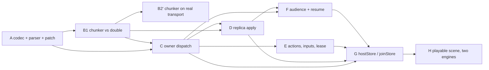

# Stage 7 — the browser game store: replacement brief (PROPOSAL, not authority)

**Status: proposal for Kyra's review, repair round 3. This document
authorizes no production implementation.** It replaces the superseded
`spikes/S7_BRIEF.md` (packaged anchor, binding parity, shared TS types),
which must not be dispatched.

**Source baseline: `b235f72570c02eac8031b33e463f77a91b7595c0`.** Kyra
verified that head and a clean working tree, and independently
reproduced the chunk arithmetic (134-byte envelope, 5 934 raw, 8 046
encoded, 58 bytes headroom). That is a pin for reading and diffing only —
**it is not an independently accepted implementation base**, and Kyra's
review of this brief is not acceptance of the production transport
repairs or of the implementation receipts reported in §6.

**B2 remains independently open.**

### Repair round 1 — what changed and why

Held at `1cfaf2193be6bc711b5437250918b63706277bb2`: direction sound, wire
contract left necessary operations undefined. This round is a bounded
documentation repair, not a redesign. The accepted transport, chunking
and replay decisions are preserved verbatim.

| # | Repair | Where |
|---|---|---|
| 1 | The control exchange and its correlation: resume, resynchronize, concurrent joins, audience acknowledgement — plus who allocates `g` | §1.2, §1.4, §1.5–1.8 |
| 2 | The lease no longer expires a healthy idle spectator | §1.6, §2 |
| 3 | Action retirement, rejection, replay binding, floor advance, exhaustion — and the `closed` / `result-expired` contradiction resolved | §1.10, §2 |
| 4 | Message budgets beyond snapshots: actions, results **before commit**, deltas, refusal details, startup fail-fast, byte budgets | §1.9, §1.11, §2 |
| 5 | Parser and patch semantics frozen, not exemplified | §1.12, §1.13 |
| 6 | The gate statement reconciled: local chunker acceptance separated from transport-composition acceptance | §4 |

One correction accepted into the text: my "a field that can be written
cannot be an identity" was inaccurate as stated — a *signed* field can
carry authenticated identity. The store's boundary is right for a
different reason, now given properly in §1.3.

### Repair round 2 — what changed and why

Held at `7d101a157c54c8a8d4cd5c68404bff7ece2d05c5` with substantial
repair credit: the request correlation, unified manifest, idle-client
renewal, retained refusals, request-content binding, result-size
validation before commit, parser/patch rules and the B1/B2′ split were
accepted. What remained were **specific lifecycle contradictions**, not
architecture. Strict missing-parent / missing-removal-key refusal is
settled and unchanged.

| # | Contradiction | Repair | Where |
|---|---|---|---|
| R1 | A replayed outcome echoed the *original* `q`, which the caller no longer has outstanding — so the reply is dropped by the correlation rule and the promise never settles | retain the **outcome** and the binding, construct a fresh envelope echoing the **current** `q`; byte identity applies to `out`, not to the envelope | §1.2, §1.10, §5.1b |
| R2 | `resume` could answer `ok` on evidence the owner does not have, and leaked recovery into application code | a successful `resume` **always** installs a fresh snapshot/live boundary; automatic; non-ready while recovering; no action or input replayed. **"Handle ready" defined** on both sides | §1.6 |
| R3 | Fencing at *acceptance* was later than `setAudience`'s contract, which clears the local view immediately; and a random `q` cannot order two requests | three separate moments — local intent (immediate), owner acceptance (allocates), installation (only the desired transition) — with a **desired-transition slot** deciding recency instead of comparing ids. An accepted-then-superseded generation stays **consumed** | §1.7 |
| R4 | Generations fenced audiences only, so a same-generation resync could roll the installed revision back or revive a retired assembly | `g` becomes the **installation generation**, allocated for every accepted replacement (join, audience, resume, resync, owner-initiated), with solicited/unsolicited admission rules | §1.7, §1.8 |
| R5 | Renewal at "step 4 (binding)" preceded payload validation (binding is step 5, payload step 6); and a 60 s/20 s lease does not actually tolerate two losses | renewal linearizes **after full validation and acceptance**; expiry ordering stated; the two-loss claim **withdrawn** and replaced by a measurement; action refusal explicitly distinguished from read revocation | §1.6 |
| — | Cleanup: prose said `h` is absent on a join reply (the `man` carries it) and that every caller message has `q` (`in` does not); `canonical(in)` and the digest were undefined | §1.12's per-kind table is **normative** where prose disagrees; the binding's canonical form and retention form are defined | §1.2, §1.10, §1.12 |

### Repair round 3 — one bounded state-machine repair

Held at `7969a585f`. No new subsystem, and the accepted codec,
chunking, replay and lease choices are unchanged. What was missing was
**coherence between the lifecycle states**, so the repair is a single
explicit state machine (§1.7a) plus the admission split (§1.7b), and the
surrounding prose now reads off it.

| # | Incoherence | Repair | Where |
|---|---|---|---|
| S1 | `resync` described `g` as the caller's *installed* generation while the binding ladder required it to equal the owner's *current* one — so a replacement whose assembly timed out left the client unable to ask for recovery | `resync`'s `(g, have)` are **advisory historical position**. Authenticate and bind the handle; never require the caller to have installed the generation whose failed delivery prompted recovery | §1.8 |
| S2 | Admission tested `g > installed`, which does not stop a **delayed manifest reopening an abandoned generation** that never installed | three distinct values — `installed`, `assembling`, and a **`retired` watermark** (highest ever admitted). Admission tests `g > retired`, so an abandoned generation is inadmissible for ever. Duplicate active manifests fall out of the same rule | §1.7a, §1.8 |
| S3 | An **empty** transition slot was read as consent to an unsolicited install, so an owner emission could undo the cancellation/refusal fence promised one paragraph earlier | explicit states: only **`ready`** accepts owner refreshes; **`fenced`** is left exclusively by the caller's own next request. Equal pending callers reconciled: **one wire request and one `q` per transition**, many independently cancellable local waiters | §1.7a, §2 |
| S4 | `aud` was refused until every chunk of the *previous* installation had been emitted, contradicting audience-change-during-synchronization — the client cleared locally and could then be refused a new view | **gameplay readiness** (`act`, `in`) is separated from **lifecycle control admission** (`aud`, `resync`, `resume`, `leave`, `alive`). A newer `aud` supersedes an in-progress installation and retires its unsent chunks; `leave` and recovery never depend on finishing the work they stop | §1.7b |
| — | Reconnect state contradicted itself: one place retained the stale snapshot, another cleared it | **reconnect retains** (same audience, so the game keeps rendering); **an audience change clears** (visibility changed, so continuing to show it is a disclosure) | §1.6, §1.7a |
| — | The SHA-256 path introduced an `await` inside what must be a synchronous admission | canonicalize and digest **before** the transaction, then revalidate handle/session liveness, generation and replay state; **no** captured authorization or transaction context crosses the await | §1.10 |

Scope is unchanged from the plan's Stage 7
(`docs/internal/plans/BROWSER_NATIVE_WEBRTC_TRANSPORT_PLAN.md:2825`) and
the API design
(`docs/internal/plans/BROWSER_GAME_STORE_API_DESIGN.md`). Every
packaging and parity deferral in the plan's §Deferred stands — dedicated
anchor crate, binary release matrix, Docker/compose/GHCR,
Node/Python/Go/C anchor-role parity and its FFI surfaces, shared
generated types across `sdk-ts`, general statistics/Deck expansion,
serverless, CRDTs, asset economies, browser-side RedEX, ICE-TCP,
DTLS-exporter.

---

## 1. The store protocol

UTF-8 JSON. One versioned envelope, a closed kind set, no free-form body.

### 1.1 Identifier representations

The rule is the one the package already enforces, and it exists because
two spellings of one id is a defect class this repository has paid for
(`node.ts`: a decimal node id passed to a hex-only method addresses a
*different* node rather than failing).

| Value | Representation | Why |
|---|---|---|
| node id (`authority`) | 16 lowercase hex | The spelling `nodeIdHex()` hands out and `connectPeer` takes. A decimal id is **refused**, never coerced. |
| store definition id | string, 1..=128 bytes | From `defineStore`. |
| store definition version | JSON integer, `1 ..= 2^31-1` | Small by construction. |
| application key | string, 1..=128 bytes | Names the ship/room/region. |
| incarnation `inc` | 16 lowercase hex | One per hosted-store instance, CSPRNG at `hostStore`. |
| handle id `h` | 32 lowercase hex (16 bytes) | Owner-issued, CSPRNG, never caller-chosen. |
| request id `q` | 16 lowercase hex (8 bytes) | Caller-issued per request, CSPRNG. §1.2. |
| generation `g`, revision `r`, sequence `s` | **canonical decimal strings** | `u64`. A JS number rounds above 2^53, and a rounded fence has stopped fencing. Canonical form: §1.12. |
| chunk index `i` / count `n` | JSON integer, `i` `0..=254`, `n` `1..=255` | Bounded below the JS-number hazard; `n ≥ 1` always. |
| chunk payload `d` | canonical base64 of UTF-8 bytes | §1.9, §1.12. |

### 1.2 Envelope and correlation

Every message carries exactly these common fields:

```json
{ "v": 1, "k": "<kind>", "h": "<handle>", "q": "<request>" }
```

- `v` — **protocol** version, not the store's. An unknown `v` is refused
  whole (`version-mismatch`); no field of an unknown version is read,
  because reading one is how a forward-compatible parser becomes an
  attack surface.
- `k` — kind, from the closed set in §1.4.
- `h` — handle id. Absent **only** on `join` itself, and on a `no` that
  refuses a join. The reply to a `join` is a `man`, which **does** carry
  the handle it minted — that is how the caller learns it.
- `q` — **request id.** Every caller→owner *request* carries one; every
  owner→caller reply *to* a request echoes it verbatim. Two exceptions,
  both in the §1.12 table, which is normative where this prose and it
  ever disagree: `in` carries no `q` (fire-and-forget, no reply, nothing
  to correlate), and unsolicited owner→caller emissions (`delta`, an
  owner-initiated `man` + `snap`, the expiry `no`) carry none.

**Why a request id rather than a stream per join.** A dedicated stream
would also work, but it makes the correlation implicit in transport
allocation and adds ownership and replacement rules for the stream
itself. `q` correlates:

- **two concurrent joins from one caller**, neither of which has a
  handle yet — the thing the previous draft could not express;
- **an audience transition's acknowledgement or refusal**, so a delayed
  `no` cannot be mistaken for the current transition. This is the
  correlation the previous draft lacked: `no` had `s` for actions and
  nothing for audiences;
- **a resume and a resynchronization**, which are otherwise
  indistinguishable from the emissions they trigger.

A reply whose `q` the caller does not have outstanding is **dropped and
counted**, never applied. A duplicate `q` from the same caller within its
retention window (§2) is refused `invalid-data`; `q` is not a
deduplication key for actions — `s` is (§1.10).

**`q` orders nothing.** It is random, so it identifies a request and
says nothing about which of two requests is newer. Wherever recency
matters — audience transitions, installations — the ordering comes from
caller-local intent and owner-allocated generations, never from
comparing request ids (§1.7, §1.8).

**A replayed outcome gets a fresh envelope.** The retained thing is the
**outcome representation** and the request binding, not the reply
message: a duplicate `act` arrives under a *new* `q`, so the owner
constructs a new `res`/`no` echoing **that** `q` and carrying the
retained outcome verbatim. Byte identity is a property of `out` (or of
`code`/`detail`), not of the envelope. Replaying the original envelope
would echo the original `q`, which the caller no longer has outstanding
— so the reply would be dropped by the rule three paragraphs above, and
the caller would sit on a promise that never settles.

### 1.3 Authenticated session binding

- A store message is accepted **only** on a peer-addressed stream over an
  established end-to-end session (direct or routed). The caller's
  identity is **the session's authenticated peer**.
- The envelope carries no originator field. The reason is not that
  written fields cannot be authenticated — a *signed* field can be — but
  that this protocol has no signing layer of its own and must not grow
  one: its authority is the session the mesh already authenticated, so a
  second identity claim inside the payload could only ever be a weaker,
  unverified duplicate of it.
- An **anchor-addressed** stream and a generic channel event are
  **inadmissible** transports for store messages: the former's session
  peer is the anchor, the latter carries an origin *hash*. An
  origin-hash → node-id lookup identifies a candidate; a verified
  announcement binds that candidate to identity material; neither proves
  this message came from it. What does: the accepted end-to-end
  establishment and its authenticated receive path
  (`leaf/src/node.rs` §9 step-2 witnesses around `:3483` — the responder
  stays provisional until the initiator's establishment proof over the
  handshake transcript promotes it).
- The owner binds each handle to the authenticated peer at admission and
  re-checks on every subsequent message. A session replacement does not
  re-authorize a handle; it requires `resume` (§1.6).

### 1.4 The kind set

Caller → owner, each carrying `q`:
`join`, `resume`, `resync`, `act`, `in`, `aud`, `alive`, `leave`.

Owner → caller:
`man` (manifest, echoes `q` when solicited), `snap`, `delta`, `res`,
`ok`, `no`.

```json
{"v":1,"k":"join","q":"<16hex>","def":"pirate.ship","ver":1,
 "key":"black-petrel","aud":["crew"]}

{"v":1,"k":"man","q":"<16hex>","h":"<32hex>","inc":"<16hex>",
 "g":"1","r":"418","n":3,"bytes":"14208"}

{"v":1,"k":"snap","h":"<32hex>","g":"1","r":"418","i":0,"n":3,
 "d":"<base64>"}

{"v":1,"k":"delta","h":"<32hex>","g":"1","base":"418","r":"419",
 "ops":[{"o":"r","p":["ship","heading"],"val":90},
        {"o":"x","p":["crew","bosun"]}]}

{"v":1,"k":"resume","q":"<16hex>","h":"<32hex>"}
{"v":1,"k":"resync","q":"<16hex>","h":"<32hex>","g":"1","have":"418"}
{"v":1,"k":"aud","q":"<16hex>","h":"<32hex>","aud":["sea.havana"]}
{"v":1,"k":"alive","q":"<16hex>","h":"<32hex>"}
{"v":1,"k":"leave","q":"<16hex>","h":"<32hex>"}

{"v":1,"k":"act","q":"<16hex>","h":"<32hex>","s":"7","name":"fire",
 "in":{"cannon":"port"}}
{"v":1,"k":"res","q":"<16hex>","h":"<32hex>","s":"7","out":{"shot":12}}

{"v":1,"k":"in","h":"<32hex>","name":"helm","s":"1904",
 "in":{"heading":31.5}}

{"v":1,"k":"ok","q":"<16hex>","h":"<32hex>"}
{"v":1,"k":"no","q":"<16hex>","h":"<32hex>","code":"forbidden",
 "detail":"…","s":"7"}
```

`no.code` is exactly `StoreErrorCode` (`browser-ts/src/store/errors.ts`),
including `result-expired`. `s` appears only when the refusal answers a
specific `act`. `in` carries **no** `q`: it is fire-and-forget and has no
reply, so there is nothing to correlate (§1.11).

**Handle loss has one code, and it is `closed`.** The frozen taxonomy
already carries what is needed, so no code is added:

| Code | Scope | Replica disposition |
|---|---|---|
| `closed` | the handle is unusable: unknown, expired, fenced by the owner, or bound to another peer | **terminal for the handle** and for every action in flight on it — nothing replayed, no outcome inferred (§1.10) — and **recoverable for the subscription**: discard all handle-scoped state and `join` afresh, under bounded backoff, **while the caller's subscription intent is still active**. A locally cancelled (`fenced`) or left (`closed`) store discards the handle and stays where it is: automatic recovery must not undo a local decision |
| `owner-lost` | the store incarnation that held the document is gone | terminal: there is nothing to rejoin |
| anything else (`forbidden`, `capacity`, `invalid-data`, `not-ready`, `timeout`, `aborted`, `action-rejected`, `indeterminate`, `result-expired`, `version-mismatch`) | the **request** was refused | the handle survives; the request's waiters reject with the code |

A separate `unknown-handle` code was considered and **rejected**: it
would re-open the disclosure channel this section closes two paragraphs
below, where a `resume` for a handle bound to another peer must be
`closed` rather than `forbidden` precisely so that a refusal cannot
reveal whether a handle exists. A code that distinguishes "never
existed" from "not yours" is that disclosure with a different spelling.
One code, one disposition, and the recoverable/terminal distinction is
carried by `closed` versus `owner-lost`.

Rejoining is a **new** handle and a new incarnation of the view, not a
resumption: generations restart at 1 (§1.7a), and a rejoin refused
`forbidden` is what stops the loop rather than a retry budget.

**`man` is the one manifest shape**, for all three cases that install a
view: a `join`, an accepted `aud`, and a `resync`. It states the
generation, the revision the snapshot is taken at, the chunk count and
the exact decoded byte total. The chunks that follow carry the same
`(g, r)`. The previous draft specified this only for the initial join.

### 1.5 Handle admission

- `join` is the only message that may **create** a handle. The owner
  authenticates the caller (§1.3), validates `def`/`ver`/`key`, calls
  `authorize({type:'read'})`, and mints a fresh CSPRNG handle bound to
  `(authenticated peer, incarnation)`.
- `act`/`in`/`aud`/`alive`/`leave`/`resync` address an **already active**
  handle. They never create or reactivate one. An unknown or expired
  handle is refused `closed` before any dispatch, with no permanent
  tombstone.
- Rejoining mints a new handle; a caller may not select or reuse one.
- Two concurrent `join`s from one caller are two independent handles,
  correlated by their own `q`. Nothing is shared between them.

### 1.6 Resume, and the liveness the lease needs

**The repair.** The previous draft's lease expired after no authenticated
*incoming* message, which expires a connected spectator that receives
updates and sends nothing. That is a healthy client, and expiring it is a
defect.

- The replica's store implementation sends `alive` on an interval of
  **20 s** while the handle is live. This is store machinery, never game
  code: a page that renders a spectator view does nothing to stay
  subscribed.
- The lease is **60 s**.

  **No claim is made that this tolerates two lost renewals.** With a
  20 s interval the third renewal lands *at* the 60 s boundary before
  any scheduling or network delay is counted, so the honest statement is
  that it tolerates **one** loss with margin and the second is a race.
  The margin is a measured quantity, not an asserted one: §5 requires a
  test of the chosen interval/lease pair, and the pair may move on what
  that test shows.
- **Expiry ordering.** Expiry is evaluated against the lease deadline
  recorded at the last renewal. A renewal whose linearization point
  (below) falls at or after that deadline **does not revive the
  handle**: the handle is already gone, and the message is refused
  `closed` like any other for an unknown handle. There is no window in
  which a late renewal resurrects a retired handle and its ledger.
- **Renewal's linearization point is after full validation and
  acceptance.** The previous draft said "through step 4 (binding)",
  which was wrong twice: binding is step 5, and payload validation is
  step 6, so a correctly-bound message with a malformed payload would
  have renewed before being rejected. A message renews the lease **only
  once it has passed every applicable step of §1.12 and been accepted by
  the owner** — for `act`, that includes authorization and execution
  admission. Malformed, unbound, non-canonical and refused messages
  renew **nothing**, or a peer that cannot form a valid request could
  hold a handle open indefinitely.
- **An action refusal is not a read revocation.** An `act` refused by
  `authorize` renews nothing, but it does **not** end the handle, its
  read subscription or its generation: the caller keeps receiving
  `delta`s and keeps the handle alive with `alive`. Read access is
  revoked only by a denied **read** check (§1.5), which closes that
  subscription. Conflating the two would let one forbidden action drop a
  spectator's view.
- **Renewal stops** at `leave`, at handle expiry, at incarnation end,
  and when a read check is denied. The replica stops sending `alive` on
  any of these and on `close()`.
- **Expiry notification.** On expiry the owner emits an unsolicited
  `no {code:"closed"}` for that handle if a session to the caller is
  still up, so a client that was merely slow learns why rather than
  inferring it from silence. If no session is up, nothing is sent and
  the handle is gone — no tombstone is retained to announce later.

**Recovery: `resume` always installs.** The previous draft let `resume`
answer `ok` when the owner "considered the view current", which the
owner has no evidence for — `resume` carries no revision claim — and
which pushed the decision to resync back into application code. Settled
the simpler way:

- **The store resumes automatically.** Reconnection and `resume` are
  store machinery; game code neither calls it nor is asked whether to.
- While recovering, the view is **`reconnecting`/`stale` and not
  ready**. `getState()` keeps returning the last snapshot, marked stale;
  no `act`/`in` is admitted (§1.7b).

  **Reconnect retains; an audience change clears.** The distinction is
  deliberate and the two must not be collapsed: a same-audience
  reconnect has not changed what the caller may see, so the last
  snapshot is **retained** and marked stale — a game keeps rendering the
  world it had while recovery runs. An audience change *has* changed
  visibility, so the projection is **cleared** to `empty()` at request
  time, because continuing to show data the new audience may not include
  is a disclosure. §1.7a's transition table carries this: `reconnect`
  retains, `setAudience` clears.
- A successful `resume` **always establishes a fresh snapshot/live
  boundary**: a new installation generation, a `man`, its chunks, and
  validated installation before the handle is ready again. There is no
  "nothing installed" success.
- **No old action or input is replayed.** Sequences are not resent; an
  action submitted before the interruption stays `indeterminate` unless
  a `res`/`no` for it arrives (§1.10), and latest inputs are dropped on
  disconnect.
- `no {code:"closed"}` when the handle is gone, and **no original action
  outcome is inferred** from that (§1.10).
- A `resume` for a handle bound to a different peer is `closed`, not
  `forbidden`: the refusal must not disclose that the handle exists.

**"Handle ready", defined.** The parser refuses actions before readiness
(§1.12 step 4), so the transition needs naming rather than implying:

| Side | Ready means |
|---|---|
| Replica | The manifest for the **currently desired** installation has been received, every chunk assembled, the byte total matched, the assembled document validated by `state()`, and the result published as revision `r` of generation `g`. Not before; a partial or unvalidated assembly is never ready. |
| Owner | The handle exists, is bound to this authenticated peer and incarnation, has a current generation whose manifest it has **emitted in full** (all `n` chunks handed to the transport), and has not expired. |

Before ready the owner refuses **gameplay** traffic (`act`, `in`) with
`not-ready`; lifecycle controls stay admissible (§1.7b). The two
definitions are deliberately different: the owner cannot know the
replica installed anything, so its readiness is about what it has
emitted, and the replica's is about what it has validated. Neither side
infers the other's.

### 1.7 Generations are installation identity; local fencing is immediate

**Two repairs, one mechanism.** `g` was "subscription generation",
allocated at `join` and at each accepted `aud`. That left two holes: a
resynchronization could replace the installed view **within** the same
generation, so nothing fenced an old manifest against a newer one; and
"an accepted `aud` fences the old generation" put fencing *later* than
`setAudience`'s existing API contract, which clears the local view
immediately.

So `g` becomes the **installation generation**: the identity of one
accepted snapshot replacement, whatever caused it.

- **Owner-allocated, monotone per handle, only on acceptance**, for
  **every** accepted installation: `join`, accepted `aud`, `resume`,
  solicited `resync`, and an owner-initiated replacement. A refused,
  superseded or malformed request consumes none.
- **An allocated generation is consumed for ever.** A generation that is
  accepted and then superseded is **not rolled back** and is never
  reissued, even though nothing was ever installed under it. Rollback is
  the one thing that could make two different installations share an
  identity.
- `aud` and `resync` carry no proposed `g`; the accepting `man` carries
  the generation the owner allocated. (`resync` carries the generation
  the caller is *currently installed at*, as context for the owner's
  projection, never as a proposal.)
- The owner stamps `man`/`snap`/`delta` with the generation they belong
  to. What a replica does with an arriving generation is **§1.7a's
  admission rules, not a single "is it current" test**: a `man` needs
  `g > retired`, a `snap` needs `g = assembling`, a `delta` needs
  `g = installed`. A stale `man` can neither roll back the installed
  revision nor reopen a retired assembly.

### 1.7a The installation state machine

**This section is normative for admission.** Round 2 stated the three
moments as prose and left four incoherences: a recovery request could be
refused for naming a stale generation, an abandoned generation could be
reopened by a late manifest, an owner emission could undo a local
cancellation fence, and a newer audience request could be refused
because the *previous* installation was still being emitted. One state
machine settles all four.

#### Replica state, per handle

Per-handle state. Three of these are monotone generation values, and
they are different things:

| Value | Meaning |
|---|---|
| `installed` | the generation whose snapshot is published, or none |
| `assembling` | the generation of the **open** assembly, or none |
| `retired` | the **highest generation ever admitted**, whether or not it went on to install |
| `skipped` | the highest owner generation **dropped because it arrived mid-transition**, or none — bounded recovery knowledge |
| `behind` | the owner is known to have moved past the revision being assembled — one flag, coalesced into the same recovery as `skipped` (§1.9a) |
| `handle` | the `h` the owner issued, once one has been **learned** from a `man`, or none. Only `join` creates one (§2) |

`retired` is the watermark, and it is what round 2 was missing: a
manifest is admissible only when `g > retired`, so a generation that was
admitted and then abandoned **cannot be reopened**, even though it never
became `installed` and therefore still satisfies `g > installed`. One
bounded monotone number, not a tombstone collection.

Five states:

| State | Meaning | Unsolicited `man` |
|---|---|---|
| `joining` | no view yet, a `join` in flight (its `q` is the slot) | **inadmissible**; skip recorded |
| `ready` | a view is installed and current; accepting owner refreshes | **admissible** |
| `installing` | a transition is in flight (its `q` is the slot) | **inadmissible**; skip recorded |
| `fenced` | locally fenced: the previous view was invalidated and the transition then failed or was cancelled. Not ready, no view | **inadmissible**; **no** skip recorded |
| `closed` | handle gone | inadmissible |

**`fenced` is the repair for item 3.** Round 2 admitted an unsolicited
manifest whenever "the slot is empty", and cancellation/refusal clears
the slot — so an owner emission could silently undo the very fence the
preceding paragraph promised. An empty slot is not consent: only `ready`
accepts owner refreshes, and `fenced` is left **exclusively** by a new
caller-initiated request (`aud`, `resync`, `resume`).

#### Transitions

| From | Event | To | Side effects |
|---|---|---|---|
| `joining` | **initial `man`** admitted (`q` = the pending join's slot, expected authenticated owner, `g > retired`) | `installing` | **the handle is learned** from `man.h`; bind the incarnation; `retired := g`; open the assembly |
| `ready`/`fenced` | `setAudience` accepted locally | `installing` | **immediately**: status `syncing`/`stale`, projection cleared to `empty()`, **any open assembly retired**, one wire `aud` with one fresh `q` as the slot |
| `ready` | reconnect | `installing` | status `reconnecting`/`stale`; **the last snapshot is retained, not cleared** (§1.6 — the audience has not changed); one `resume`, its `q` the slot |
| `joining`/`installing`, **handle learned** | reconnect | `installing` | **the lost session's assembly is retired**; one `resume` whose `aud` is the **latest desired audience**, never the owner's older one; a published view is retained and marked stale |
| `joining`, **no handle learned yet** | reconnect | `joining` | a fresh **`join`**, not a `resume`: only `join` creates a handle, and the replica has none to resume (§2) |
| `joining`/`installing`/`ready` | `no {closed}` (correlated, or the unsolicited expiry notice) | `joining` | the handle and **all** its generation state are discarded, the view cleared, and **one fresh `join`** issued — the only path that can produce a handle. Nothing is replayed (§1.10) |
| `fenced` | `no {closed}` | `fenced` | the handle and its generation state are discarded, but **the fence is not lifted**: the caller cancelled this subscription, and an expiry notice is no more their consent than an owner refresh was. Their next request issues the `join`, because with no handle learned that is the only request it can issue |
| any live | `no {owner-lost}` | `closed` | terminal: the incarnation that held the document is gone, so there is nothing to rejoin |
| any live | any other `no` for the slot's `q` | `fenced` | the **request** was refused, not the subscription: the handle survives |
| any | a message naming a handle other than the learned one | unchanged | dropped and counted (`foreign-handle`) |
| `ready` | gap / patch failure / assembly abandoned | `installing` | one `resync` carrying the **advisory** `(g, have)` of what is installed now (§1.8) |
| `installing` | `man` admitted (`q` = slot, `g > retired`) | `installing` | `retired := g`; `assembling := g`; open the assembly |
| `installing` | assembly complete **and still the active installation** (its `q` is still the slot; an owner refresh additionally requires the state to still be `installing`) | `ready` | `installed := g`; publish; slot cleared; waiters resolve; then §1.8's skipped-refresh recovery |
| `installing` | assembly complete but its transition was **superseded** | unchanged | dropped and counted; **nothing is published** |
| `installing` | assembly deadline, conflict, or validation failure | `installing` | `assembling := none`; **`retired` keeps `g`**; one new `resync` with the advisory position of `installed` |
| `installing` | `no` for the slot's `q` | `fenced` | waiters reject with the code; slot cleared; **assembly retired** |
| `installing` | every local waiter cancelled | `fenced` | slot cleared; **assembly retired**; the previous view is **not** restored — it was invalidated at request time |
| `installing` | newer `setAudience` | `installing` | previous waiters reject `aborted`; **new** `q` becomes the slot; **the open assembly is retired immediately** and can no longer publish; `retired` keeps its value |
| `ready` | unsolicited `man` (`g > retired`) | `installing` | `retired := g`; `assembling := g`; no slot (unsolicited) |
| `joining`/`installing` | unsolicited `man` (`g > retired`) | unchanged | dropped and counted; `skipped := max(skipped, g)` |
| `fenced` | unsolicited `man` | unchanged | dropped and counted; **no skip recorded** — the fence is the caller's to lift |
| any | `no {closed}` / lease expiry | `closed` | — |

**Duplicate active manifest.** A second `man` for a generation whose
assembly is already open fails `g > retired` (because admitting the
first set `retired := g`), so it is **dropped and counted** and the open
assembly is untouched.

**Retirement is not publication.** Because every supersession path
retires the open assembly, the completion check above is an invariant
rather than the mechanism — and an invariant with no witness is an
assumption, so it is asserted directly against the state a forgetful
supersession path would leave behind
(`test/store/lifecycle.test.ts`, "publication is fenced against the
exact active installation"). Running the inverse is what showed the
branch was otherwise unreachable.

#### One wire request, many local waiters

Round 2 said each waiter has its own `q` (§2) while admission used a
single slot `q` — those cannot both hold. Resolved the way Kyra
indicated: **one wire request and one `q` per shared transition**, with
multiple **local** waiters attached to it, each independently
cancellable with its own deadline and signal. Cancelling one removes
that waiter only; cancelling the last moves the handle to `fenced`. A
later equal-set request joins the in-flight transition as another local
waiter rather than issuing a second `q`.

#### Owner state, per handle

**Per handle means per handle.** Every value below is scoped to one
handle, including the generation allocator, the audience, the unsent
remainder and any deferred projection. Nothing about an installation is
owner-global except the store revision, which is a property of the
document rather than of a subscription.

| Value | Meaning |
|---|---|
| `allocated` | highest generation ever allocated **for this handle**; monotone, **never rolled back**, even for a generation that was superseded before anything was installed |
| `emitting` | the generation whose chunks are still being handed to the transport for this handle, or none |
| `emitted` | the generation whose chunks have all been handed over — the owner's "gameplay ready" (§1.6) |
| `aud` | the audience bound to this handle — what a `resync` recovers (§2) |
| `deferred` | one pending projection for this handle, if availability made it wait (§1.8) |
| `live` | whether the handle is still valid; expiry sets this and **retires this handle's pending projection and unsent chunks** |

Consequences that are easy to lose by keeping installation state on the
owner instead of the handle:

- **A second `join` disturbs nothing.** Its installation is allocated
  against its own handle, so it cannot retire or redirect another
  handle's unsent chunks.
- **Generations restart per handle.** Handle B's first installation is
  generation 1 even though handle A reached 7. This is why a replica
  that discards a handle (§2's `closed` path) must discard
  `installed`/`retired`/`assembling` with it: keeping A's watermark
  would fail `g > retired` against B's generation 1 and strand the
  rejoin.
- **Superseding or expiring one handle leaves every other operational**
  — including `advance`, which emits a delta to each live handle and
  none to a dead one.
- **Expiry retires pending work; it does not merely mark a flag.** A
  deferred projection left behind by expiry would be completed when
  availability returned, installing for a handle nobody holds.
  Completion is therefore a **second admission point**: the pending
  projection is re-submitted to the one place where a projection
  becomes an installation, which revalidates the handle and refuses a
  dead one with a **delivered** `no {closed}` — so the caller rejoins
  instead of waiting out its deadline. Refusal never recreates
  admission: only `join` does that.
- **No owner-initiated replacement takes the caller's turn**, and
  there is **one admission point** for all of them — an explicit
  refresh, an overflow detected while advancing, and an overflow whose
  queue drains later — because a rule satisfied on one path and
  bypassed on another is not a rule. A replacement is refused when a
  projection cannot be taken, when a solicited transition is already
  pending for that handle, or while that handle's own emission is
  outstanding (§1.9a). Installing clears `deferred`, so a replacement
  in the second case would silently discard the caller's request and
  its desired audience and leave availability restoration with nothing
  to complete.
- **A pending solicited installation subsumes the recovery need.** It
  takes a fresh projection at the current revision, which is strictly
  more than the replacement would have carried, so the recovery is
  dropped rather than the request. The two differ in what the caller
  sees: the request carries the audience they asked for.
- The paths differ only in whether the need **survives** a refusal.
  Overflow recovery is the owner's own and is retained for the drain;
  an explicit refresh is the caller's and is simply refused, so nothing
  is left armed behind them.

### 1.7b Control admission is not gameplay readiness

**The repair for item 4.** Round 2 refused `aud` until every chunk of
the previous installation had been emitted, which contradicts the
required audience-change-during-synchronization behaviour: the client
clears immediately and its new request would then be refused *because
the old snapshot was still going out*.

Two separate admission classes:

| Class | Kinds | Admitted when |
|---|---|---|
| **Gameplay** | `act`, `in` | the handle is `emitted` for its current generation — these need an installed view to be meaningful |
| **Lifecycle control** | `aud`, `resync`, `resume`, `leave`, `alive` | the handle is live and bound, **including while a previous installation is still being emitted** |

- A valid newer `aud` **supersedes an in-progress installation**: the
  owner allocates the next generation, **retires the unsent chunks** of
  the superseded one (they are never emitted, and the superseded
  generation stays consumed), and emits the new manifest.
- `leave` and the recovery controls likewise **cannot depend on
  completing the work they exist to stop**. A `leave` during emission
  retires the unsent remainder and closes the handle.
- `not-ready` therefore refuses only gameplay traffic. It is never the
  answer to a lifecycle control on a live handle.
- The converse bound is on the **owner**: a *caller* control supersedes
  an in-flight emission, but the owner does not supersede its own
  (§1.9a). The asymmetry is not arbitrary — a caller's replacement is
  solicited and the replica is waiting for that exact `q`, whereas an
  unsolicited one arrives at a replica that is correctly refusing
  unsolicited manifests mid-transition.

### 1.8 Resynchronization

- A replica sends `resync {h, g, have}` when a `delta.base` does not
  equal its current revision, when a chunk assembly is abandoned (§2),
  or when a patch fails validation.
- **`g` and `have` are advisory historical position, not a claim about
  the owner's current state.** The owner authenticates the session,
  binds the handle, and **does not require `g` to be its current
  generation**. This is the repair for item 1, and the sequence that
  forced it is an ordinary recovery path rather than malformed traffic:
  the replica is installed at A; the owner allocates B and sends a
  replacement; B's assembly times out before installation; the replica
  asks to recover, and the only generation it can honestly name is
  **A** — the one it actually has. A current-generation check refuses
  exactly the client that most needs recovering.
- The owner answers a solicited `resync` with a **newly allocated
  installation generation** and its `man` + chunks, or `no
  {code:"closed"}` for a dead handle. A `resync` is **never** refused
  for naming a stale or unknown generation.
- **One projection-unavailable disposition: defer, never refuse.** If
  the owner cannot take a projection at the moment a control arrives, it
  holds **one** pending projection per handle and emits the manifest
  when it can. Bounded recovery: the caller's own deadline is the bound,
  and a timeout is retried with capped backoff, so a control never has
  to interpret `not-ready` — the disposition §1.7b promised and the
  earlier text contradicted. A newer control replaces the pending
  projection rather than queueing behind it. **A dead handle never
  acquires one:** a control on an expired handle is refused
  `closed` before the deferral branch, and expiry retires any
  projection already pending (§1.7a). Completion revalidates regardless,
  because the handle can die between deferral and availability.
- v1 defines no delta-from-`have` path and a caller must not depend on
  one.
- The owner may **initiate** a replacement — used when a delta would
  exceed the message budget (§1.9) — by allocating a generation and
  emitting an unsolicited `man` (no `q`) followed by its chunks. It is
  admissible only in `ready` (§1.7a).
- **A skipped owner refresh is recovered, not stranded.** The sequence
  is ordinary: the replica is installing B, the owner advances to C and
  emits a refresh, the replica drops it because it is mid-transition,
  and then B completes. C's deltas would then be inadmissible forever
  — owner and replica would never converge. So a dropped refresh
  records `skipped := max(skipped, g)`, and on reaching `ready` a
  replica with `skipped > installed` issues **one coalesced** `resync`
  and returns to `installing`; several skipped refreshes still produce
  one request. `skipped` is cleared once an installation subsumes it.
  A `fenced` replica records nothing, so this is not a way to reopen a
  cancellation fence. Under §1.9a's ordered stream plus the owner's
  no-self-supersession rule this path is **unreachable**; it is retained
  and witnessed by explicit out-of-order injection, because the
  alternative is a replica whose convergence depends on an assumption
  with no defence behind it.

**Admission, in one table.** Every rule reads off §1.7a's four values
and the state:

| Arrival | Admitted iff | Otherwise |
|---|---|---|
| Anything, once a handle is learned | `h` = the learned handle | dropped, counted (`foreign-handle`) |
| Solicited `man` (has `q`) | state is `joining` or `installing`, `q` = slot, **`g > retired`** | dropped, counted |
| Unsolicited `man` (no `q`) | state is **`ready`** and `g > retired` | dropped, counted; `joining`/`installing` record the skip, `fenced` *specifically* does not, so an owner emission cannot undo a cancellation fence. The replica's own next request is what leaves `fenced`. |
| `snap` chunk | `(h, g, r, n)` match the **open** assembly and `g = assembling` | dropped, counted |
| `delta` | state is **`ready`**, `g = installed`, `base` = installed revision | dropped (wrong state or `g`), `resync` (gap), or — for `g = assembling`, which ordering makes unreachable — dropped with `behind` set, so completion recovers (§1.9a) |

The `delta` row is **state-gated as well as generation-gated**. Without
the state test, a delta naming the generation the replica last installed
is admissible while that view is cleared — so an audience change or a
cancellation would be undone by the next old-generation delta, quietly
repopulating a projection the caller had just revoked.

Consequences, including the cases the HOLDs named:

- **An old manifest after a newer view is installed** fails
  `g > retired`; it cannot roll back the installed revision.
- **An abandoned generation cannot be reopened.** B is admitted
  (`retired := B`), its assembly is abandoned, and a delayed second B
  manifest — or a late first one — fails `g > retired`. Under round 2's
  `g > installed` rule it would have passed, because B never installed.
- **A restarted snapshot at the same revision** is a different
  generation, so the abandoned attempt's chunks cannot join it.
- **Old assembly chunks after a restart** carry a generation that is no
  longer `assembling` and are dropped. A retired assembly is never
  recreated, by a chunk or by a manifest.
- **A solicited resync overlapping an unsolicited one**: the unsolicited
  one is inadmissible because the state is `installing`; exactly one is
  current.

### 1.9 Snapshot chunks, and the budget for every kind

- The owner serializes the **projected** state to UTF-8 JSON, splits the
  **bytes** into `n` pieces, and sends `i = 0..n-1`.
- Each piece is canonical base64 in `d`. Base64 because splitting UTF-8
  on byte boundaries can split a code point, and carrying raw text would
  make an interior chunk invalid JSON string content. The +33 % is
  accounted for below rather than discovered later.
- **Budget, derived at runtime, never hardcoded.** The reserve is the
  **`snap` envelope's**, not a global one — each kind's envelope is
  measured against its own frozen field list (§1.12):

  ```ts
  const SNAP_ENVELOPE_RESERVE = 192;   // measured worst case: 134 B
  const chunkBytes =
    Math.floor((maxEventBytes() - SNAP_ENVELOPE_RESERVE) / 4) * 3;
  ```

  At today's wire: `floor((8104 − 192)/4) * 3 = 5934` raw bytes per
  chunk — 7 912 base64 characters plus a 134-byte envelope is 8 046,
  which is 58 bytes inside the limit. Every field is at its maximum
  spelling in that measurement (20-digit `u64` decimals, 32-hex handle,
  `i`/`n` at 255), so the reserve is a bound and not a sample.
- `maxEventBytes()` is the wire's `MAX_EVENT_SIZE` (`accb8f2f9`) — the
  packet cap **minus** header, tag and the event frame's 4-byte length
  prefix. `MAX_PAYLOAD_SIZE` (8108) is not available data bytes;
  treating it as such overruns by exactly the prefix.
- **Measured envelopes for the other bounded kinds**, at maximum
  spelling, so each budget is derived and not assumed:

  | Kind | Envelope | Budget for its variable part |
  |---|---|---|
  | `snap` | 134 B | `chunkBytes` = 5 934 raw → 7 912 base64 |
  | `delta` | 151 B | `maxEventBytes() − 192` = 7 912 B for `ops` |
  | `man` | 197 B | none — fixed shape, no variable part |

  `man` exceeds the `snap` reserve and that is not a conflict: it
  carries no payload, and the reserve exists only to leave room for
  `d`. Stated because a single "envelope reserve" invites reading it as
  a global bound.
- **Startup fail-fast.** If `maxEventBytes()` is unavailable, or
  `chunkBytes < 1024`, or any frozen envelope exceeds
  `maxEventBytes()`, `hostStore` and `joinStore` **refuse to start**
  with a typed `capacity` error naming the numbers. A store that cannot
  fit its own envelope must not begin and then discover it.

**The repair: every kind has a size disposition, not only `snap`.**

| Kind | Disposition |
|---|---|
| `act` | The **caller** encodes and measures before submitting. Over budget → `StoreError('capacity')` thrown locally, **nothing sent, nothing executed**. |
| `res` | The owner validates the handler's output **and its encoded size before commit** (§1.10). Over budget → the transaction is discarded and the caller gets `no {capacity}`. An action must never commit and only then discover its result cannot be encoded. |
| `delta` | Encoded `ops` must fit the 7 912 B above. If a revision's ops do not, the owner emits **no delta for it**: it initiates a resynchronization (§1.8) for that handle instead. A bounded, defined path — not a silent drop and not an oversized frame. |
| `in` | Caller-side measured like `act`; over budget → `dropped/capacity` disposition, nothing sent. |
| `no.detail` | ≤ 256 B, truncated at the owner with a trailing `…`. A refusal that cannot be delivered is worse than a terse one. |
| `ok`, `resync`, `alive`, `leave`, `man` | Fixed shape, bounded by construction and checked at startup. `aud` is bounded by 32 labels × 128 B, checked before send. |
| `resume` | Fixed shape plus `aud`, bounded by the same 32 × 128 B check. |

### 1.9a The snapshot/live boundary, and the ordering it assumes

**Assumption, stated because it is load-bearing: one reliable, ordered
stream per handle.** Every kind for a handle — `man`, `snap`, `delta`,
`res`, `no` — rides that one stream in emission order, so what the
owner hands over first arrives first.

**Ordered transport is not an emission order.** FIFO delivery only
preserves the order the owner *produced*; it cannot repair an owner
that produces a `delta` while that handle's snapshot chunks are still
unsent. So the boundary is a property of the **emitter**: each handle
has one ordered output queue, and a `delta` produced mid-emission is
queued **behind** that handle's remaining chunks, based at the revision
its snapshot was taken at. The document may advance whenever it likes;
`advance` touches every live handle and each one's delta waits for its
own snapshot. That is what makes the snapshot/live boundary a boundary
rather than a race, and it is why v1 needs no delta *buffer* on the
replica — the ordering is established before the bytes leave.

**Pending work is bounded.** A handle's queue has a ceiling. Reaching
it means incremental catch-up has failed for that subscription, so the
queued deltas are retired and the installation is **replaced** — the
same disposition §1.9 gives a single over-budget delta, applied to
queue depth. A replica is therefore never asked to hold unbounded work,
and never has to ask for a recovery the owner could see coming.

**The replacement is scheduled at the moment of overflow, not at the
next dequeue.** Retiring the queued deltas can *empty* the queue — a
delta-only queue overflowing is exactly that case — and a recovery that
waits for "the next message handed over" then waits for ever, which is
silent divergence whenever the overflow-causing update is the last one.
So overflow schedules the replacement immediately and the admission
rules below decide whether it runs now or at the drain. Nothing about
convergence may depend on further traffic arriving.

Two rules keep that assumption from becoming load-bearing for
**silence** as well as for liveness — a broken assumption must produce
recovery, never a replica that quietly renders a revision behind the
owner for ever:

- **The owner never supersedes its own in-flight emission.** An
  unsolicited replacement is allocated only when the previous
  installation's chunks have all been handed over. Otherwise the
  replica — which correctly refuses unsolicited manifests while
  installing (§1.7a) — would hold an assembly whose remaining chunks
  the owner just retired, and would then drop the replacement's chunks
  as belonging to no assembly: *both* generations stalled until a
  deadline. The owner is not otherwise constrained: the document may
  advance whenever it likes, including mid-emission (below).
  A **caller** control still supersedes mid-emission (§1.7b): its
  manifest is solicited, and the replica is waiting for exactly that
  `q`.
- **A `delta` naming the generation being assembled sets `behind`.**
  Ordering makes it unreachable; if it is ever seen, the owner has
  moved past the revision of the snapshot in flight, so the replica
  records one flag and, on completing the installation, issues **one**
  `resync` — coalesced with the skipped-refresh recovery of §1.8, so
  two reasons to recover still produce one request.

Under this assumption the `skipped` watermark of §1.8 is likewise
unreachable: a refresh cannot overtake the chunks of the installation
it replaces, and the owner will not emit one mid-emission. It is
retained, and witnessed by explicit out-of-order injection (§5.1d),
because an invariant whose only defence is an assumption is an
assumption.

### 1.10 Actions: retirement, rejection, replay

**The repair.** The ledger algorithm, complete.

- `s` is a canonical decimal `u64`, **strictly increasing per handle**,
  starting at `1`. Request identity is
  `(authenticated caller, handle, s)` within one incarnation.
- The owner keeps, per handle: a `floor` (the highest retired `s`), and a
  retained window of outcomes keyed by `s`, bounded by count, age and
  **bytes** (§2).
- Each retained entry records the **outcome representation** and the
  **request binding**, defined below. It does **not** retain a reply
  message: a replay arrives under a new `q` and gets a freshly
  constructed envelope carrying the retained outcome (§1.2).

**The request binding, defined.** "A digest of `(name, canonical(in))`"
named no serialization and no algorithm, and canonical *integer* fields
do not define a canonical form for an arbitrary input object. Both are
fixed here. Only the owner computes and compares this value — it never
crosses the wire — so what matters is self-consistency, not
cross-implementation agreement.

- **Canonical form of `in`**: `name`, then a `0x1f` separator, then the
  input serialized as JSON with object keys sorted ascending by UTF-16
  code unit, no insignificant whitespace, strings escaped minimally
  (only what JSON requires, `\uXXXX` lower-case hex for controls), and
  numbers rendered by ECMAScript `Number::toString` — which is exact for
  every value the store admits, because §1.12 already refuses `NaN`,
  `Infinity` and duplicate keys, and identifiers needing full integer
  precision are strings by the §1.1 rule.
- **Retention form**: the canonical string itself when it is ≤ 2 KiB,
  otherwise its SHA-256 (32 bytes, via WebCrypto). Comparison is
  equality of whichever form is retained, and the form is recorded with
  the entry so a 2 KiB boundary crossing cannot make two encodings of
  one request compare unequal.
- **The digest's `await` happens before the transaction, and nothing is
  carried across it.** WebCrypto's `digest` is asynchronous, and a
  handler transaction is synchronous by construction (`store/core.ts`),
  so the order is fixed: canonicalize and digest **first**, then
  **revalidate** — handle still live and bound, session still the same
  incarnation and peer, generation still current, and the replay state
  re-read — and only then enter the synchronous transaction and
  authorize.

  No authorization decision, and no transaction context, may be captured
  before that `await` and used after it. Both are exactly the
  stale-continuation hazard §2 already fences for handlers: a
  permission checked before the await could have been revoked during it,
  and a context is valid only inside its own synchronous transaction.
  The ledger must also be re-read rather than remembered, because a
  concurrent request for the same `s` may have retired or retained an
  entry while the digest was computing.

  This is why the ≤ 2 KiB string path is the common case and not an
  optimization: it has no `await` at all, so the hazard does not arise
  for it.
- Storing the string where it fits is deliberate: it keeps the common
  case free of a hash dependency and makes a mismatch inspectable when
  a witness fails.

Dispositions, exhaustively:

| Case | Disposition |
|---|---|
| `s` > every seen `s`, handle active | validate, `authorize`, execute once, retain and reply `res`. |
| `s` retained, same binding | **re-`authorize` first**; if still permitted, reply a **new** envelope echoing this request's `q` and carrying the retained outcome verbatim; if no longer permitted, `no {forbidden}`. A retained *refusal* replays as that refusal. |
| `s` retained, **different** binding | `no {invalid-data}`. Not executed, and the retained entry is **not** overwritten: a sequence identifies one request, not a slot. |
| `s` ≤ `floor`, not retained, handle active | `no {result-expired}` — cannot execute again, original result unavailable, **no commit asserted**. |
| `s` ≤ some seen `s` but skipped (a gap) | Gaps are permitted and do not block. A `s` inside a gap that was never seen is treated as new **only if** `s` > `floor`; at or below the floor it is `result-expired`. |
| handle expired or unknown | `no {closed}`. **No original outcome is inferred** — this is not `result-expired`, because the owner no longer knows whether the sequence ever ran. |
| `s` = `2^64 - 1` reached | `no {capacity}`; the counter does **not** wrap. The caller must rejoin for a fresh handle, and prior outcomes are then unknown. |

- **A rejected action is retired with its rejection.** Authorization
  denial and handler throw both produce a retained entry (`forbidden` /
  `action-rejected`), not an absent one. So a policy change cannot turn
  an earlier refusal into a later execution of the same sequence — the
  failure mode the repair names.
- **Floor advance.** The floor advances only by eviction from the
  retained window, in `s` order, so an entry is never dropped while a
  lower one is retained. Concurrent requests are admitted up to the
  pending bound (§2) and are dispatched one at a time per handle, so
  ordering is total per handle and the floor cannot skip a live entry.
- No automatic resend after connection or leader change. An action
  aborted or refused before submission is known not to have executed;
  once submitted, timeout/abort/session loss is `indeterminate` unless a
  `res` or `no` establishes the outcome.

### 1.11 Latest inputs

- `s` is monotone per `(handle, input name)`. The owner applies a
  strictly increasing `s` and **drops and counts** any `s ≤ last seen`.
- Fire-and-forget: loss is not an error, there is no retention, no replay
  and no gap recovery, and `in` carries no `q` because it has no reply.
- **Loss does not imply a successor.** A dropped input may be the last
  one, so the *game* must tolerate a missing final input — the store
  makes no "a newer one will arrive" promise. Stated because the
  coalescing design invites the opposite assumption.
- One pending slot per `(handle, name)` on the caller; at most one
  in-flight send plus one replacement. Owner-local dropped-input counters
  per handle, readable by the owner's own code; not a protocol message.

### 1.12 The parser, frozen

Ordered. Cheap checks first, and none of them may run after a mutation.

1. **Byte length** > the admissible size (§1.9) → refuse, count, no
   parse.
2. **JSON parse**: depth ≤ 16, no duplicate keys, no `NaN`/`Infinity`,
   numbers finite. On failure `invalid-data`, counted.
3. **Envelope**: `v` known; `k` in the closed set; `q` present iff the
   kind requires it; `h` present iff the kind requires it.
4. **Direction and class**: a kind may only arrive in its defined
   direction — a replica that receives `act` or an owner that receives
   `delta` refuses `invalid-data` and counts it. Then by admission class
   (§1.7b): **gameplay** (`act`, `in`) before the handle is ready is
   `not-ready`; **lifecycle controls** (`aud`, `resync`, `resume`,
   `leave`, `alive`) are admissible on a live handle **including during
   an emission**, and are never refused `not-ready`. Anything after
   `leave` is `closed`.
5. **Binding**: handle active, bound to this authenticated peer and
   incarnation. Generation is checked **per kind against §1.7a/§1.8**,
   not by one blanket "must be current" rule: `delta` requires
   `g = installed`, a `man` requires `g > retired`, a `snap` requires
   `g = assembling`, and **`resync`'s `g` is advisory and is checked
   against nothing** — requiring it to be current is exactly the defect
   S1 repaired.
6. **Payload**: per-kind required/optional fields (below), then the
   definition's validators.

**Per-kind fields.** Required unless marked optional; **unknown fields
are refused**, not ignored. Forward compatibility is the `v` bump's job,
and silent tolerance of unknown keys is how a typo becomes a
silently-ignored security-relevant field.

| Kind | Required | Optional |
|---|---|---|
| `join` | `v k q def ver key aud` | — |
| `resume` | `v k q h aud` | — |
| `resync` | `v k q h g have` | — |
| `aud` | `v k q h aud` | — |
| `alive`, `leave` | `v k q h` | — |
| `act` | `v k q h s name in` | — |
| `in` | `v k h name s in` | — |
| `man` | `v k h inc g r n bytes` | `q` (absent when owner-initiated) |
| `snap` | `v k h g r i n d` | — |
| `delta` | `v k h g base r ops` | — |
| `res` | `v k q h s out` | — |
| `ok` | `v k q h` | — |
| `no` | `v k code` | `q` (absent when unsolicited — the §1.6 expiry notice), `h`, `s`, `detail` |

A `no` **with** `q` answers that request; a `no` **without** `q` is an
unsolicited notification about `h` (only `closed`, at lease expiry) and is
applied to the handle rather than correlated. A `no` carrying neither `q`
nor `h` is refused `invalid-data`: it names nothing.

**`resume` carries `aud`; `resync` does not.** A reconnecting caller
must not be re-shown the audience the owner happened to have last:
that audience may be wider than what the caller now wants, and
re-delivering it is the disclosure §1.6 refuses to accept. So `resume`
states the caller's **latest desired audience** and is authorized
exactly like `aud` — the read-authorization check for the requested
audience runs before any projection is taken, and a `resume` naming an
audience the caller may not read is refused, not narrowed. `resync` is
a *position* recovery **within the audience already bound to the
handle**, so it carries no audience and the owner reads that from the
handle; a `resync` cannot change what a caller can see. Recovering the
desired audience with a bare `resume` plus a follow-up `aud` was the
alternative and is rejected: it opens exactly the window in which the
wider previous audience is delivered.

**Only `join` creates a handle.** Every other request carries `h` and
is refused `closed` when `h` is unknown or expired — an owner
must never allocate a handle to satisfy a `resume`, because an
unauthenticated-by-construction `h` is exactly what a forged `resume`
supplies. Before a handle has been **learned** (the caller has sent
`join` but no `man` has arrived), automatic reconnect therefore issues
a **fresh `join`**, not a `resume`: the replica has nothing to resume.
On `no {closed}` the replica discards its handle and rejoins,
which is the only path that can produce a new one. It discards the
handle's **generation state** with it — `installed`, `retired`,
`assembling`, and the recovery flags — because generations are monotone
per handle (§1.7a) and the new handle's first installation is generation
1. A retained watermark would fail `g > retired` and strand the rejoin
it was supposed to enable. The handle is
learned from the `man` that answers the join; traffic naming any other
handle is dropped and counted.

**Canonical encodings.** A non-canonical spelling is `invalid-data`, not
normalized — one spelling per value, so a digest and a comparison cannot
disagree:

- **Decimal** (`g`, `r`, `s`, `bytes`, `have`): ASCII digits only, no
  sign, no leading `+`, no leading zero unless the value is exactly
  `"0"`, ≤ 20 digits, ≤ `2^64 - 1`.
- **Base64** (`d`): standard alphabet, correctly padded, no line breaks
  or whitespace, and it must decode to exactly the length the chunking
  implies.
- **Hex** (`h`, `q`, `inc`): lowercase only, exact length.

**Snapshot assembly consistency.** `n ≥ 1`; every `i` in `0..n-1`
present exactly once; all chunks carry the same `(h, g, r, n)`; the sum
of decoded chunk lengths equals `bytes` exactly. **The assembled
document** — not each chunk envelope — is then JSON-parsed under the same
depth and duplicate-key rules and validated by the definition's
`state()` before anything is published. The previous draft applied the
checks per chunk, which validates the envelopes and not the snapshot.

### 1.13 Patch semantics, frozen

- Operations: `{"o":"r","p":[…],"val":…}` (replace) and
  `{"o":"x","p":[…]}` (remove). `p` is an array of **own property-name
  segments**, length ≤ 8, each 1..=64 bytes. Arrays are replaced whole in
  v1. No JSON Pointer escaping, no arbitrary or executable operations.
- **Root.** `p: []` with `o:"r"` replaces the whole state and is
  permitted. `p: []` with `o:"x"` is **refused** — a state must exist.
- **Missing parent**: the whole patch is refused and a resynchronization
  is requested. The replica's view disagrees with the owner's, and
  guessing is worse than resyncing.
- **Missing key on `x`**: likewise refused, for the same reason. A remove
  whose target is absent means the views have already diverged.
- **Ordering and overlap**: operations apply in array order; a later
  operation may overwrite an earlier one's subtree; the result is defined
  by that order. Duplicate identical paths are permitted and count
  against the op bound.
- **Traversal is own-property only.** A segment equal to `__proto__`,
  `constructor` or `prototype` is refused; traversal never follows the
  prototype chain, and objects are built with null prototypes.
- **Atomicity**: validate the complete patch, apply to a draft, validate
  the **final state** with the definition's `state()`, then commit one
  revision preserving unchanged subtree references
  (`store/state.ts::reconcile`, `dcc13ca7c`). A half-applied patch is
  never published; a failed patch leaves the previous revision intact and
  triggers resynchronization.
- **Revisions** are of the **projected view**: `r` is monotone per
  `(handle, generation)`, and `delta.base` must equal the replica's
  current `r`. Changes elsewhere in the owner's state that the viewer
  cannot see must never surface as unexplained revision gaps.

---

## 2. Resource ownership

No unbounded state, no silent retry of an ambiguous action. Count limits
alone are not a memory budget, so bytes are bounded wherever they can
grow.

| Bound | Value | Reclaimed by |
|---|---|---|
| snapshot bytes | 1 MiB | refusal at projection (`capacity`) |
| store message bytes | derived (§1.9) | refusal before parse |
| chunk assembly | **one** in-flight per `(handle, generation)`, ≤ 1 MiB and ≤ 255 chunks | completion; generation change; 10 s assembly deadline; handle expiry |
| in-flight assemblies per owner | ≤ 8 MiB total across handles | refusal (`capacity`) of the newest |
| patch ops / depth / segment | ≤ 256 ops / ≤ 8 / ≤ 64 B | refusal |
| pending actions per handle | 32 | refusal (`capacity`) |
| result ledger per handle | last 32 outcomes **and** ≤ 64 KiB **and** ≤ 60 s — whichever binds first | eviction in `s` order → floor advance → `result-expired` |
| outstanding `q` per caller | 64, ≤ 60 s | expiry; a reply for an unknown `q` is dropped and counted |
| audience labels per handle | 32, each ≤ 128 B | refusal |
| handles per owner | 256 | refusal (`capacity`) |
| buffered owner egress | 1 MiB across all handles | refusal (`capacity`) |
| handle lease | 60 s since the last **accepted** authenticated message; `alive` every 20 s | handle + ledger removed; unsolicited `no {closed}` if a session is up |
| join / action / audience / resync deadline | 10 s | typed `timeout`; a submitted action becomes `indeterminate` |
| `no.detail` | 256 B | truncation at the owner |

Fencing:

- **Chunk assembly** is discarded on generation change, handle expiry and
  deadline. A partial snapshot is never published and never merged into a
  later one.
- **Cancellation is per waiter; the wire request is not.** Equal pending
  audience requests share **one** wire request and **one** `q` (§1.7a),
  with a local waiter each — its own deadline and signal. Cancelling one
  removes that waiter only; cancelling the last moves the handle to
  `fenced` and it stays non-ready. A newer transition rejects the
  previous waiters `aborted` and takes the slot with a **new** `q`. No
  aborted promise may later resolve from a snapshot callback.

  Round 2 gave each waiter its own `q` here while admission compared a
  single slot `q` — the two could not both hold, and the per-waiter
  spelling is the one that had to go: `q` is the transition's identity
  on the wire, not a waiter's.
- **Stale continuations** cannot write: a transaction context is valid
  only during its synchronous transaction (`store/core.ts`, `dcc13ca7c`).
- **Expired handles** are refused `closed` before dispatch, and the
  ledger goes with them — which is why replay after handle eviction is
  `closed` and not `result-expired` (§1.10).

---

## 3. Settled design this brief preserves

1. **One shared TypeScript peer driver** (`peer-driver.ts`, `eae11eca9`)
   used by `BrowserNode` and `MeshSession`. No second implementation in
   TS or Rust.
2. **Chunks fit the effective unfragmented payload limit, overhead
   included**, derived from `maxEventBytes()` (§1.9).
3. **Explicit absence in projections**: collections omit invisible
   entities, hidden fields are explicit `null` or a tagged value,
   `empty()` is absence. Zero never means "you cannot see this".
4. **Structural sharing**: unchanged subtrees retain identity; an
   equivalent resynchronization snapshot is a no-op.
5. **Peer-addressed authenticated sessions** for delivery, direct or
   routed. Never anchor-addressed streams or generic channel events for
   store traffic (§1.3).

---

## 4. Implementation prerequisites vs acceptance gates

**Prerequisite** = the slice cannot be written without it.
**Acceptance gate** = the slice can be written and adversarially tested,
but may not be *accepted* without current-head evidence.

**The repair.** The previous round's handoff advertised A and B as
ungated while the table gave B a reliable-transfer gate. B is split, and
the two halves are accepted separately.

| # | Slice | Prerequisites | Acceptance gate |
|---|---|---|---|
| A | Protocol codec, parser ladder, patch semantics (§1.12–1.13), local only | none beyond the baseline | **none** — local and deterministic |
| B1 | Chunker, assembler, assembly reclamation, consistency checks, **against an in-process transport double** | A; `maxEventBytes()` (landed) | **none** — the splitting, assembly, duplicate/conflict/partial and byte-total rules are properties of this code |
| B2′ | The same chunker **composed with the real stream transport** | B1 | **Reliable transfer at the current head.** The chunking decision removes large-frame fragmentation from the snapshot's necessary path; it does **not** establish that chunks ride the shared reliability/reassembly code intact under loss, duplication and reorder. |
| C | Owner dispatch: join, admission, `authorize`, projection, `man` | A, B1 | **Authenticated origin.** `authorize` must receive the authenticated originating caller. No substitute is acceptable. |
| D | Replica: snapshot install, delta apply, resync, generations | A, B1, C | Reliable transfer (as B2′) |
| E | Actions, results, ledger, latest inputs, lease and `alive` | C | Authenticated origin; the §1.10 ledger semantics |
| F | Audience transitions, `resume` | C, D | Authenticated origin |
| G | `hostStore` / `joinStore` exports over `MeshSession` | C–F | **Leader-proxy lifecycle**: follower tabs, last-consumer cleanup, the peer/stream lifecycle. Membership lifecycle and peer-addressed proxied streams are landed (§6); the *store's* use of them on a follower is not established. |
| H | Playable Three.js scene, two engines, direct + forced fallback | G | All three gates, plus §5.4 |

**On the historical HOLDs.** This brief marks S6-01 and Stage 5
R4-1..R4-10 **neither repaired nor still reproducible**. Either claim
needs current-head evidence and neither is in hand. What the brief does
is name the three properties and the slices whose *acceptance* requires
each, so closure can be established against the head actually delivered.

---

## 5. Acceptance cases

Derived from the contract. Encoder/decoder round trips are table stakes
and are **not** acceptance.

### 5.1 Adversarial — required

| Case | Observable |
|---|---|
| **Forged origin** — a peer sends `act` naming another caller's handle on its own authenticated session | refused `closed`; handler ran 0 times; no revision; counter moved. The binding refuses it, not a field check. |
| **Wrong owner** — a third peer advertises the same `def`/`key` and emits `man`/`snap`/`delta` to a joined replica | dropped; view unchanged at its revision; counter moved. Definition/key coincidence is not authority. |
| **Wrong session** — a live handle's messages arrive on a different session | refused; `resume` required; a handle is never resumed onto an unauthenticated session |
| **Handle of another peer** — `resume` for a handle bound elsewhere | `closed`, **not** `forbidden` — the refusal does not disclose existence |
| **Stale handle** — `act` after expiry | `closed` before dispatch; handler 0 times; **no** inferred original outcome; no tombstone |
| **Stale generation** — `delta` for a retired `g` after an accepted `aud` | dropped; not applied; not a resync trigger; new view's revision unchanged |
| **Late refusal for a superseded audience** — `no` arrives for the older `aud` after a newer one was accepted | attributed to the **older `q`**, rejects only that waiter, and does not mark the current transition failed |
| **Generation reuse attempt** — a refused `aud`, then a second one | the second accepted `aud` allocates a **strictly greater** `g`; the refused request consumed none |
| **Revision gap** — `delta.base` ≠ current | patch **not** applied; `resync` sent; no dependent successor applied over the gap |
| **Conflicting duplicate chunks** — two `snap` with the same `(h,g,r,i)` and different `d` | assembly refused and restarted; **nothing** published; counter names the conflict |
| **Partial snapshot** — `n-1` of `n`, then the deadline | nothing published; assembly reclaimed; status stays `syncing`/`stale`, never `ready` |
| **Byte-total mismatch** — chunks complete but decoded length ≠ `bytes` | refused; nothing published; resync |
| **Assembled-document schema failure** — chunk envelopes all valid, assembled JSON fails `state()` | refused at the **assembled** document; nothing published |
| **Replay within retention, same input** | the retained **outcome** byte-identical, in a **fresh envelope echoing the replay's own `q`**; handler 0 times; re-authorized first. Asserting the outcome alone passes an implementation that replays the original envelope, whose reply the caller then drops. |
| **Replay within retention, different input at the same `s`** | `invalid-data`; not executed; retained entry unchanged |
| **Replay of a retained refusal after policy widened** | the retained **refusal**; handler 0 times. A refusal must not become an execution because policy changed. |
| **Replay after result eviction, handle live** | `result-expired`; handler 0 times; **no commit asserted** |
| **Replay after handle eviction** | `closed`; no inferred outcome |
| **Retained replay after permission revoked** | `forbidden`, not the stored result |
| **Sequence exhaustion** | `capacity`; no wrap; rejoin required |
| **Audience removal during synchronization** | in-flight assembly fenced and discarded; projection cleared to `empty()`; older waiters rejected by `q` and unable to resolve later from a snapshot callback |
| **Idle spectator** — receives deltas, sends only `alive` for > 3 leases | **remains subscribed**; no expiry |
| **Absent client** — no `alive` for > 1 lease, then late traffic on the old handle | expired; late `act`/`alive` refused `closed`; the old handle cannot be revived |
| **Malformed traffic does not renew** — a stream of malformed or unbound messages across a lease | handle still expires on schedule |
| **Oversized action** | refused **before** submission; nothing sent; nothing executed |
| **Result that cannot be encoded** | transaction discarded; `capacity`; **no commit**; owner state unchanged |
| **Oversized delta** | no oversized frame and no silent drop: owner-initiated resynchronization instead |
| **Runtime cap too small for the envelope** | `hostStore`/`joinStore` refuse to start, naming both numbers |
| **Unknown field** in any kind | refused `invalid-data`, not ignored |
| **Non-canonical decimal / base64 / hex** | refused, not normalized |
| **Wrong direction** — replica receives `act`, owner receives `delta` | refused `invalid-data`, counted |
| **Depth bomb, duplicate keys, `NaN`** | refused at parse, bounded, counted |
| **Unknown `v` or `k`** | refused whole; no field read |
| **Reply for an unknown `q`** | dropped and counted; never applied |
| **Patch at root** — `r` with `p:[]` accepted; `x` with `p:[]` refused | as stated; refused case leaves the revision intact |
| **Missing parent / missing removal key** | whole patch refused; resync; previous revision intact |
| **Prototype-named segment** (`__proto__`, `constructor`, `prototype`) | refused; no prototype traversal; no global mutation observable |
| **Overlapping ops** | applied in array order, last writer wins, result matches the stated order |

### 5.1a Discriminating cases for this round's repairs

Each repair gets a case that a pre-repair implementation **passes** and
a repaired one distinguishes — the point being to test the repair, not
to re-test the thing that already worked.

| Repair | Discriminating case | What separates repaired from not |
|---|---|---|
| 1 — correlation | Two `aud` in flight; the **older** is refused after the newer is accepted | Pre-repair, `no` carried no audience correlation, so the refusal is indistinguishable from a refusal of the current transition. Repaired: the `no` echoes the older `q`, only that waiter rejects, and the current transition stays pending/ready. A test that merely asserts "a refusal arrived" passes both. |
| 1 — concurrent join | Two `join`s issued before either replies | Pre-repair there is no field that tells the replies apart; both handles are plausible answers to either request. Repaired: each reply echoes its own `q`, and crossing them is detectable. |
| 1 — generation allocation | `aud` refused, then `aud` accepted | Pre-repair the caller proposed `g`, so a retry could reuse or skip one. Repaired: the accepted generation is strictly greater than the last accepted, and the refused request consumed none. Assert the **sequence of allocated generations**, not just that the second succeeded. |
| 2 — lease | A spectator that receives 4 leases' worth of deltas and sends only `alive` | Pre-repair it expires, because only incoming traffic renewed and it sent none. Repaired: still subscribed. Its twin — an absent client whose late `act` is refused `closed` — passes both, so it is not the discriminating half. |
| 2 — renewal linearization | A peer whose messages bind correctly but carry a malformed payload, continuously across a lease | Pre-repair, renewal at "step 4 (binding)" let a correctly-bound but invalid message renew, so the handle lived forever. Repaired: renewal is after full validation **and** acceptance, so it expires on schedule. The cruder "malformed at parse" version passes both, so it is not the discriminating case. |
| 3 — retained refusal | An action refused by `authorize`; policy then widened; the same `s` replayed | Pre-repair the rejected sequence was never retired, so the replay **executes** under the new policy. Repaired: the retained refusal replays and the handler runs 0 times. |
| 3 — same `s`, different input | `act s=7 fire`, then `act s=7 scuttle` | Pre-repair a sequence identified a slot, so the second either executes or overwrites. Repaired: `invalid-data`, no execution, retained entry unchanged. |
| 3 — the contradiction | Replay at `s ≤ floor` with the handle **live**, and the same replay after the handle **expired** | Pre-repair these returned the same code, so one of the two was wrong. Repaired: `result-expired` for the live handle, `closed` for the expired one, and the second asserts **no** inferred outcome. |
| 4 — result before commit | An action whose handler mutates state and returns an output just over the encode budget | Pre-repair it commits and then fails to encode, leaving the owner's state advanced and the caller told `capacity`. Repaired: the owner's revision is **unchanged** and the handler's effect is discarded. The observable is the revision, not the error. |
| 4 — oversized delta | A revision whose ops exceed the delta budget | Pre-repair: an oversized frame or a silent drop. Repaired: an owner-initiated `man` + chunks for that handle, and the replica ends at the same revision the owner is at. |
| 4 — startup | `maxEventBytes()` stubbed below the envelope | Repaired: `hostStore` refuses to start naming the numbers. Pre-repair it starts and fails on the first snapshot. |
| 5 — assembled-document validation | Chunks whose envelopes are individually valid but whose concatenation fails `state()` | Pre-repair, per-chunk checks pass and the invalid document is published. Repaired: refused at the assembled document, nothing published. |
| 5 — unknown field | A `join` with one extra key | Pre-repair, ignored. Repaired: refused. A lenient parser passes every other case in §5.1. |
| 5 — non-canonical decimal | `g: "007"` and `g: "+7"` | Pre-repair, coerced to 7 by a permissive reader, after which a digest comparison and an equality check can disagree. Repaired: refused. |
| 5 — missing removal key | `x` on an absent key | Pre-repair, a no-op that leaves two views silently divergent. Repaired: patch refused, resync requested, previous revision intact. |
| 6 — gate split | B1 accepted against the in-process double; B2′ held pending current-head reliable-transfer evidence | Not a test but an acceptance case: B1's receipts must not be offered as B2′'s. |

### 5.1b Discriminating cases for round 2's repairs

| Repair | Discriminating case | What separates repaired from not |
|---|---|---|
| R1 — replay envelope | `act s=7` under `q=A` completes; the same `s=7` is resubmitted under `q=B` | Pre-repair the retained *reply* is replayed, so the envelope echoes `q=A`, the caller has no such request outstanding, and the reply is dropped — the promise never settles and the test times out rather than failing loudly. Repaired: a fresh envelope echoes `q=B` and carries the same `out` bytes. Assert the settled value **and** the echoed `q`. |
| R2 — resume installs | Reconnect with the owner's revision unchanged since the interruption | Pre-repair `ok` is a legal answer, so a replica can be "ready" having installed nothing and validated nothing. Repaired: a new generation, a manifest, chunks, validated installation, and the handle non-ready until then. Assert the installed generation **advanced** and that `getStatus()` was non-ready throughout. |
| R2 — no replay on resume | An action submitted, then the session drops before its `res` | Repaired: after resume the action is still `indeterminate`, is **not** resent, and the handler's invocation count is unchanged. A pre-repair implementation that resent it would show two invocations. |
| R3 — fencing at request time | `setAudience` called, and the owner's answer **withheld** | Pre-repair the old view stays current until acceptance, so `getState()` still serves the previous audience's data and `getStatus()` reads ready. Repaired: immediately `syncing`/`stale` with the projection cleared to `empty()`, before any owner traffic. This is the case an acceptance-time implementation passes only by accident. |
| R3 — latest intent wins | Two `setAudience` calls; the **first**'s manifest arrives last | Pre-repair, arrival order decides and the stale manifest installs. Repaired: dropped by the desired-transition slot, and the view ends at the second call's audience. |
| R3 — no generation rollback | An `aud` accepted (generation allocated), then superseded before its manifest arrives | Repaired: the next accepted generation is strictly greater than the superseded one — the allocation is not reused. Assert the allocated sequence, not just monotonicity of installed views. |
| R4 — stale manifest | An old `man` for a retired generation arrives after a newer view is installed | Pre-repair, same-generation resyncs made this indistinguishable from the current one and the installed revision could roll **back**. Repaired: dropped on the `g`-greater test; installed revision unchanged. |
| R4 — restart at the same revision | An assembly abandoned at revision R, then a fresh snapshot also at R | Pre-repair, `(h,g,r)` identity makes the late chunks of attempt 1 indistinguishable from attempt 2's and they can complete a mixed assembly. Repaired: different generations, so the old chunks fail the open-assembly match and cannot recreate the retired assembly. |
| R4 — solicited vs unsolicited overlap | An owner-initiated `man` arrives while a `resync` is in flight | Repaired: the unsolicited one is dropped (slot occupied), the solicited one installs, and exactly one is current. |
| R5 — lease margin | The chosen interval/lease pair under one lost renewal, and under two | Not a pass/fail of a claim but a **measurement**: record what one loss and two losses actually do at the chosen pair, and let the pair move on the result. The brief no longer asserts two-loss tolerance, so a test asserting it would be testing a claim that was withdrawn. |
| R5 — action refusal is not read revocation | A forbidden `act`, then continued `delta` delivery | Repaired: the handle stays live, the read subscription intact, deltas still arriving, and only the action refused. A pre-repair conflation drops the spectator's view on one forbidden action. |

### 5.1c Discriminating cases for round 3's state machine

| Repair | Discriminating case | What separates repaired from not |
|---|---|---|
| S1 — stale resync accepted | Installed at A; owner allocates B and sends it; **B's assembly times out before installation**; the replica sends `resync` naming A | Pre-repair the owner's current-generation check refuses the recovery request, and the client that most needs recovering is the one that cannot. Repaired: the `resync` is accepted, a fresh generation C is allocated, and the replica ends **installed at C**. Assert the recovery *succeeded*, not merely that a `resync` was sent. |
| S2 — abandoned generation cannot reopen | A installed; unsolicited B admitted; B's assembly abandoned; a **delayed B manifest** arrives | Pre-repair, `g > installed` holds (B never installed), so the stale manifest reopens the abandoned installation. Repaired: `g > retired` fails, it is dropped, and the installed view stays at A. The existing old-**chunk** witness does not cover this — it takes an old **manifest**. |
| S2 — duplicate active manifest | Two `man` for the same generation while its assembly is open | Repaired: the second is dropped and the open assembly is untouched. Pre-repair there was no rule, so either could restart the assembly. |
| S3 — cancellation fence survives an owner refresh | A transition cancelled (handle `fenced`), then an **unsolicited** `man` arrives | Pre-repair the slot is empty, so "no pending request" admits it and the owner's emission silently undoes the cancellation fence. Repaired: inadmissible in `fenced`; the handle stays non-ready until the caller's own next request. Assert the status **and** that nothing installed. |
| S3 — ready still accepts refreshes | The same unsolicited `man` while `ready` | The control: it **must** install. A repair that simply refused all unsolicited manifests would pass S3 and fail this. |
| S3 — one `q`, many waiters | Two equal `setAudience` calls, then one cancelled | Repaired: one wire request was sent, the surviving waiter still resolves, and the handle reaches `ready`. Pre-repair, per-waiter `q`s mean either two wire requests or a slot that cannot match both. |
| S4 — newer audience during emission | `setAudience` issued while the previous installation's chunks are still being emitted | Pre-repair it is refused `not-ready` — the client has already cleared its view locally and now cannot get a new one. Repaired: admitted, the unsent chunks of the superseded generation are retired, and the new generation installs. |
| S4 — leave during emission | `leave` mid-emission | Repaired: the unsent remainder is retired and the handle closes. A control must not depend on completing the work it exists to stop. |
| S4 — gameplay still gated | `act` before the manifest is fully emitted | The control for S4: gameplay **stays** refused `not-ready`, so the repair separated the two classes rather than opening both. |
| Reconnect vs audience | Same-audience reconnect, and an audience change, each inspected mid-recovery | Repaired: reconnect **retains** the stale snapshot (the game keeps rendering); the audience change **clears** to `empty()`. A single "clear on recovery" rule passes one and leaks or blanks on the other. |
| Digest await | An action whose canonical input exceeds 2 KiB, with the handle expired **during** the digest `await` | Repaired: revalidation after the await refuses `closed`, the handler runs 0 times, and no authorization captured before the await is used. Pre-repair the pre-await decision is honoured and a dead handle's action executes. |

### 5.1d The transition model, executed

The composition failures of round 3 were found by **reading** the
tables; the round-4 findings were found by **running** them. The model
is `browser-ts/test/store/lifecycle-model.ts` — a replica reducer, an
owner reducer, and a harness in `browser-ts/test/store/lifecycle.test.ts`
that delivers in per-direction FIFO order, routes by handle to either
of two replicas, stalls the owner, expires handles, breaks sessions,
and (only for the §1.9a witnesses) injects out-of-order delivery.
**66 witnesses**, plus a **39-inverse** campaign.

It is test-only by construction: no production export, no transport, no
new protocol subsystem, no `src/` change, bundle unchanged. It is not
byte-level; the codec has its own witnesses (§5.1) and mixing the two
would make a lifecycle failure look like a parse failure.

**What the model's agreement does and does not establish.** `converged()`
requires the replica to be `ready`, published, not stale, and equal to
the owner's own handle, generation *and* revision; `stillLive()` then
advances the owner and requires the delta to land. That is agreement
between **two reducers written by the same author**, not between
independently derived specifications — as the round-3 model demonstrated
by omitting handle admission on *both* sides at once. It catches
composition failures; it cannot catch a shared blind spot, and the
review that found one is the control. Generations come from the owner's
allocator in every transition trace; the two whitebox fence witnesses
construct a generation directly, which is deliberate — they assert an
invariant against a state no owner-issued trace reaches — and they are
not transition traces.

| Property | Executed witness | Inverse applied, red, reverted |
|---|---|---|
| initial join has a legal transition | "admits the first manifest against the pending join and publishes", plus refusals for a foreign `q` and an unsolicited manifest while `joining` | solicited `man` restricted to `installing` → **34 failed** |
| supersession retires the assembly | "a superseded transition publishes nothing and its successor converges"; "late chunks … publish nothing" | supersession keeps the assembly → **2 failed** |
| publication fenced to the active installation | the two whitebox fence witnesses | drop the slot check → **1 failed**; drop the state check → **1 failed** |
| deltas state-gated | "…cannot repopulate a cleared view"; "…a fenced view" | generation-only gate → **2 failed** |
| only `join` creates a handle | "reconnecting before a handle is learned rejoins instead of resuming" | reconnect resumes a handle never issued → **1 failed**; reconnect restricted to `ready` → **3 failed** |
| unknown/expired handle refused | "an expired handle is refused, and recovery rejoins" | owner honours an expired handle → **1 failed**; refusal does not rejoin → **1 failed**; one handle per owner → **1 failed** |
| handle-scoped traffic | "an unsolicited manifest for another handle installs nothing" | accept foreign handles → **1 failed** |
| `resume` carries the audience, `resync` does not | "a resync recovers within the audience bound to the handle" | `resync` carries `aud` → **1 failed** |
| one wire request per transition | "two equal audience requests share one wire request", with "a different audience supersedes instead of joining" as its control | coalescing removed → **1 failed** |
| owner does not supersede its own emission | "refuses a refresh while emitting, and the installation completes" | allow mid-emission refresh → **1 failed** |
| a violated ordering assumption recovers | "a refresh that overtakes an in-flight assembly is recovered"; "a delta that overtakes its own assembly is recovered"; "…coalesce into one resync" | skip not recorded → **2 failed**; `behind` not recorded → **2 failed**; post-install recovery not triggered → **3 failed** |
| `fenced` is the caller's to lift | "does not reopen a fenced replica with an owner refresh" | admit refreshes while `fenced` → **1 failed** |
| reconnect from every live state | "reconnects mid-assembly, fencing the lost session's work"; "reconnect from ready retains the stale view" | reconnect restricted to `ready` → **3 failed** |
| controls never answer `not-ready` | "an unavailable projection defers and still converges"; "a deferred initial join still converges" | owner refuses instead of deferring → **1 failed** |
| retirement watermark | "an abandoned generation cannot be reopened by a late manifest"; "a duplicate manifest leaves an open assembly untouched" | `g > installed` instead of `g > retired` → **2 failed** |
| handles have independent lifecycles | "a second join does not disturb the first handle's installation"; "both handles receive subsequent updates"; "superseding one handle leaves the other operational"; "expiring one …"; "expiring a handle mid-emission retires only its own chunks" | installation state owner-global again → **5 failed**; expiry does not retire its own unsent chunks → **1 failed**; `advance` emits to expired handles → **1 failed** |
| expiry retires pending work | "expiry retires the pending projection instead of completing it", with "a live deferred projection still completes" as its control | expiry marks only the flag → **1 failed** |
| completion is a second admission point | "completion refuses a handle that died without retiring its work"; "a control on an expired handle is refused, not deferred" | completion does not revalidate → **1 failed**; control admitted on a dead handle → **1 failed** |
| generations are per handle | "a request on an expired handle is refused, and recovery rejoins at generation 1" | discarded handle's watermark retained → **3 failed** |
| the emitter establishes the snapshot/live boundary | "an advance during emission is queued behind the chunks it depends on"; "several advances during one emission all land, in order" | hand the delta over ahead of unsent chunks → **3 failed** |
| pending work is bounded | "pending work is bounded: catch-up gives way to a replacement" | unbounded queue → **1 failed**; drained queue never replaces → **1 failed** |
| an owner refresh never takes the caller's turn | "does not replace a deferred caller transition"; "does not emit a manifest it cannot follow with chunks"; "does not replace a pending transition even when it could project" (whitebox) | ignore availability → **1 failed**; replace a pending transition → **1 failed**; ignore its own emission → **2 failed** |
| overflow recovery is scheduled, not hoped for | "a delta-only queue that overflows still converges"; "overflow with chunks still outstanding waits for the drain"; "overflow while a projection is unavailable recovers on restoration"; "a pending caller request subsumes the overflow recovery" | overflow not scheduled → **2 failed**; scheduling bypasses the admission point → **2 failed**; drained queue never replaces → **2 failed** |
| one admission point for every owner replacement | the three "an owner refresh never takes the caller's turn" witnesses, plus the overflow ones above | overwrite a pending transition → **2 failed**; ignore availability → **2 failed**; pre-empt its own emission → **4 failed**; explicit refresh arms the flag → **2 failed** |
| handle loss preserves local intent | "an expiry notice does not reopen a cancelled subscription"; "the caller's own next request rejoins after a fenced expiry"; with the active-subscription and local-leave controls | expiry reopens a cancelled subscription → **2 failed** |
| one recoverable handle-loss disposition | "`closed` discards the handle and rejoins, replaying nothing"; "an unsolicited `closed` notice recovers the subscription"; "`owner-lost` is terminal"; "a local leave is terminal"; "any other refusal fences without rejoining" | `closed` terminal → **6 failed**; `owner-lost` rejoins → **1 failed**; any refusal discards the subscription → **1 failed** |

Four inverses are controls on the model itself, so that strictness
cannot be mistaken for correctness: **drop every arrival** → 66 failed,
0 passed; **never hand over queued work** → 64 failed; **reuse one
handle id for every join** → 11 failed; **never allocate a generation**
→ 64 failed. A drop-everything implementation fails every positive
control and every `converged()` assertion in the file.

The inverse ledger is **implementer-run**: the mutation campaign is
mine, and the review independently ran the baseline, the typecheck and
its own probes. The two are different evidence and the distinction is
not cosmetic — an implementer-run mutation campaign proves the oracles
discriminate, while an independent probe is what found that they were
discriminating about the wrong state.

**What running it found that reading it did not.**

Round 4, from the reviewer's probes:

- The initial join never reached the owner and the replica sent
  `resume` for a handle it had never been issued — and the model owner
  answered it, because neither side modelled handle admission.
- `resume` and `resync` carried an audience the §2 schema forbade, so
  desired-audience recovery depended on a field the wire could not
  deliver.
- The equal-pending witness set `waiters` by hand, asserting the
  behaviour it was supposed to test.
- Enforcing FIFO delivery made the skipped-refresh scenario
  unreachable, which exposed that an owner refresh mid-emission stalls
  *both* generations. Fixed on the owner side (§1.9a).
- A delta for the generation being assembled was silently dropped,
  leaving the replica `ready` a revision behind the owner with no
  recovery. It now sets `behind`.

Round 5, from the reviewer's probes:

- **A deferred projection resurrected an expired handle.** Expiry
  marked the record dead but left its pending work intact, and
  completion called the installation path unconditionally, writing
  `live: true` back. Expiry now retires the handle's pending projection
  and unsent chunks, and completion revalidates (§1.7a).
- **Two handles shared one installation slot.** `g`, `aud`, `unsent`
  and `deferred` were owner-global, so a second `join` retired the
  first handle's unsent chunks and redirected the remainder. All
  installation state is now per handle; only the store revision is
  global. The "one handle per owner" inverse had proved distinct
  issuance, which is not independent lifecycles — the gap the review
  named exactly.
- Fixing that exposed the generation-scope boundary the global
  allocator had been hiding: generations restart at 1 on a new handle,
  so a replica that discards a handle must discard its watermark or
  strand its own rejoin.

Round 6, from the reviewer's probes:

- **FIFO delivery does not fix an incorrect emission order.** `advance`
  handed a `delta` over while that handle's chunks were still unsent,
  so the *ordinary* schedule produced `man, delta, snap, snap` and
  reached the path §1.9a called unreachable. Removing the global
  emission stall was right; emitting ahead of unsent chunks was not its
  replacement. The boundary is now established by the emitter — one
  ordered output queue per handle — with bounded queue depth and a
  replacement installation when the bound is reached. The
  "delta time is idle by construction" prose is gone with it.
- **An owner refresh erased a deferred caller transition.** `refresh`
  checked neither availability nor the pending solicited transition,
  and `install` clears `deferred`, so the caller's request and desired
  audience were discarded and availability restoration had nothing to
  complete. Refresh is now refused at the source in all three cases.
- **`unknown-handle` was not a legal refusal.** The frozen
  `StoreErrorCode` has no such code, so the model's recovery message
  was excluded by the very codec contract slice A is meant to freeze.
  Resolved without adding a code: `closed` covers every unusable
  handle and is terminal for the handle and its in-flight actions while
  the subscription rejoins; `owner-lost` is the terminal case. A
  distinguishable `unknown-handle` was rejected because it re-opens the
  handle-existence disclosure channel §2 closes deliberately.

Round 7, from the reviewer's probes:

- **Overflow could empty the queue without scheduling its
  replacement.** The replacement was triggered by a later dequeue, and
  retiring the queued deltas had already emptied the queue, so when the
  overflow-causing update was the last one nothing ever ran: the
  replica sat at revision 100 against an owner at 107, with an empty
  queue, the flag set, and no pending recovery on either side. Overflow
  now schedules its replacement itself.
- **Overflow completion reached installation through a second path**
  that did not carry the caller-precedence and availability rules the
  explicit refresh had just been given, so draining the old chunks
  overwrote a deferred `aud` request with an unsolicited replacement
  for the *old* audience. All three paths now share one admission
  point.
- **An expiry notice reopened a cancelled subscription.** Automatic
  rejoin fired from `fenced`, undoing the caller's own cancellation —
  the same class of defect as round 3's "an empty slot is not consent",
  arriving by a different door. Handle loss now discards the handle and
  its generation state from every state, and rejoins only where
  subscription intent is still active.

Two round-5 inverses came back **green** on first run, and both were
untested paths rather than redundant rules: a control admitted on an
expired handle reached the *deferral* branch (no witness covered
expiry + unavailable projection), and `advance` emitted deltas to
expired handles (the isolation witness drained the wire without
checking who the messages were addressed to). Both now have witnesses
and both inverses are red.

A round-7 inverse came back green for the same reason the round-3 fence
did: the refresh guard's `deferred` check is unreachable, because
`deferred` is only set while a projection is unavailable and
`projectable` completes it the instant availability returns. It is kept
with a whitebox witness, because that coupling — not the rule — is what
would make a future reason to defer reopen the hole.

One round-3 inverse came back green for the other reason: removing the
publication fence changed nothing, because every supersession path
already retires the assembly. The fence is the invariant and clearing
is the mechanism, so it is kept and witnessed directly. Three
non-discriminating oracles this stage, all caught by running inverses
rather than by reading tests.

### 5.2 Contract behaviour — required

Unchanged-update silence; selector equality; subtree identity across an
equivalent resync; `empty()` distinguishable from a zeroed record;
absence of replica `setState` at the type level; atomic patch commit; one
revision per accepted transaction; two concurrent joins from one caller
yielding two independent handles correlated by `q`.

### 5.3 Witness discipline

Every case above names its **observable on the refusing side** — a
counter, a handler invocation count, a revision, a published/not-published
view. A test asserting only the error text is not accepted: a refusal
that arrives *after* the mutation satisfies it and misses the defect.
That has already happened twice in this stage — the entity-identity
oracle and the release-frame oracle, both caught only because the inverse
was run. Each witness carries an applied-red-reverted inverse.

### 5.4 Execution environment

- Browser execution is **not** Linux-only: Chromium and Firefox runs need
  no netns.
- **Linux netns evidence is CI-only on this host.** Not a licence to mock
  it.
- **Firefox is absent from the demo harness today** (`browser-demo` is
  Chromium-only, floor 5). Adding and executing that leg is work, not
  inherited coverage.
- wasm witnesses (`wasm_witnesses.rs`) need a chromedriver this host
  lacks; they run in the leaf-wasm job, and any claim from them must say
  so.

---

## 6. Inventory reconciliation at the baseline

### 6.1 Landed, with receipts

Receipts as reported by the implementer; **Kyra's review of this brief is
not acceptance of them.**

| Commit | What | Receipts |
|---|---|---|
| `dcc13ca7c` | Local store: `defineStore`, contract types, `StoreCore` (state, subscriptions, status, synchronous transaction), structural sharing | 31 witnesses; 5 inverses red/reverted; +4 635 B bundled, tree-shakeable |
| `557fb84d4` | `LeafNode::unsubscribe` through the production `0x0A00` encoder; claim deregistered; `FollowerRegistry::release` | 3 witnesses, 3 inverses; core honours it (`mesh.rs:33720`) |
| `42d32640a` | Last-consumer decision where both `declared` and `restoration()` are visible; `MeshSession.unsubscribe` | native arithmetic witness + inverse reproducing the unsound gate |
| `688e4f08a` | `LeaderRequest::StreamOpen` carries `peer`; `require_anchor_addressed` deleted | codec round-trip + inverse |
| `c1876d62e` | `attempt_for` dialog fence; `peer_candidate_in` / `peer_handshake_in`; fixed a wasm target broken by `688e4f08a` | wasm witness (CI-executed, not run locally); `--all-targets` on both targets adopted |
| `00509bd28` | Four dialog-named peer requests, codec, leader arms, `MeshSession` methods | round-trip witnesses |
| `eae11eca9` | One shared TS peer driver; both surfaces on it; supersession classified from both sources | 8 witnesses, 2 inverses; 223 pre-existing tests unchanged |
| `accb8f2f9` | `LeafNode.maxEventBytes()` publishes the unfragmented limit | real-package probe pins the arithmetic; inverse against a rebuilt wasm |
| `b235f7257` | Proxy traffic measured as a shape, not quoted | 3 poll counts; inverse |

Docs: `7533eb9dc`, `fa0cf4c77` (dispositions and the identity
correction), `1cfaf2193` (this brief, round 0).

### 6.2 Remaining, with dependencies



Not started: A–H. Open from the landed work: effective subscription
acknowledgement as the store's readiness witness (a resolved enqueue is
not one); `authorize`'s authenticated input (gated, §4 C).

### 6.3 Deferrals preserved

Everything in the plan's Stage 7 §Deferred, in effect. Nothing here
reopens packaging, binding parity or shared generated types, and no slice
depends on them.

---

## 7. Surfaced for review

Round 0's four were dispositioned: no originator field (accepted, with
the reasoning corrected in §1.3); replay of a retained committed result
(accepted); no latest-input gap recovery (accepted, with the
"loss does not imply a successor" caveat now in §1.11); backgrounded
clients losing handles (accepted for v1, and §1.6 now keeps idle
spectators live and specifies foreground recovery).

Round 1's two are both now dispositioned:

1. **Strict missing-parent / missing-removal-key refusal: settled**, and
   kept unchanged.
2. **`resume` answering `ok`: overruled**, and the simpler alternative
   taken — a successful `resume` always installs a fresh
   snapshot/live boundary (§1.6). My reasoning was wrong in a specific
   way worth recording: I treated "the caller should resync if unsure"
   as an escape hatch, when it is recovery responsibility leaking into
   application code, and the owner never had evidence for "the view is
   current" in the first place.

Round 2 raises **nothing new**. Every decision in this round was
directed, and the three choices left to me — the desired-transition slot
as the recency mechanism, a fresh installation generation per accepted
replacement (of the two bounded transfer identities offered), and
retaining the canonical input string below 2 KiB with SHA-256 above it —
are implementation choices made in the text rather than escalated.

One thing is deliberately *not* surfaced as a question but should be
visible: the lease pair (20 s interval / 60 s lease) is now a
**measurement**, not a claim. §5.1b records what must be measured, and
the pair may move on what that shows. If you would rather fix the pair
by fiat, that is a decision I would take from you rather than infer.
